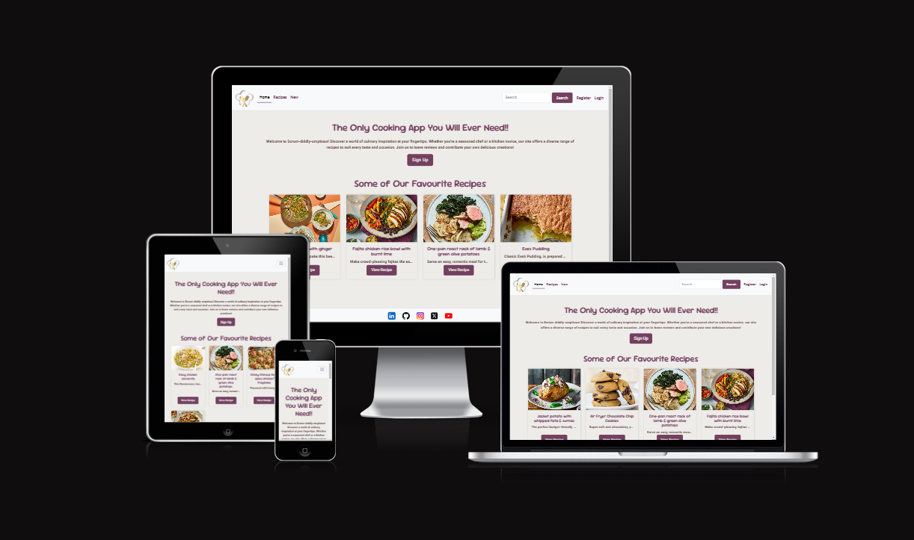
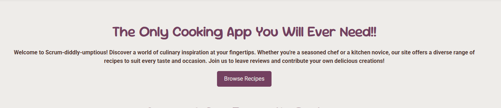
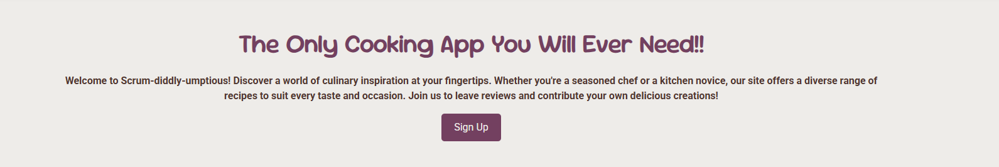
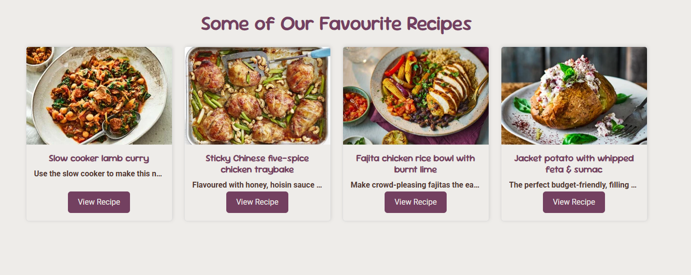
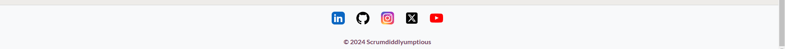
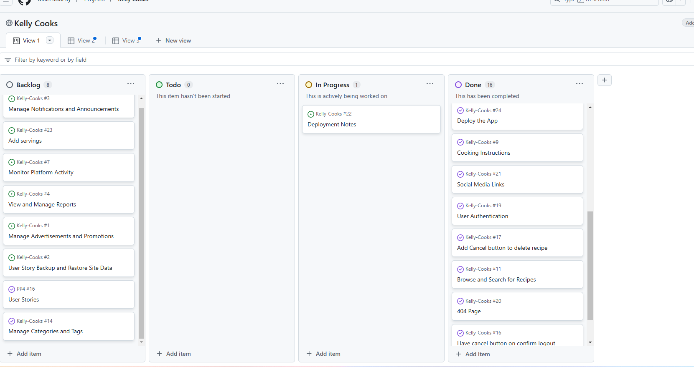
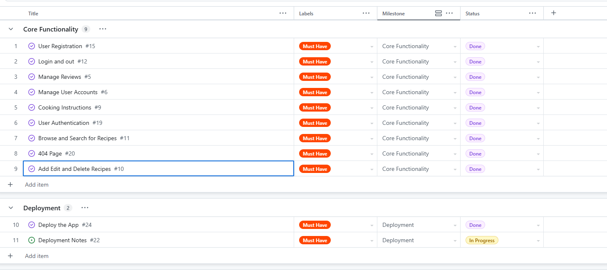
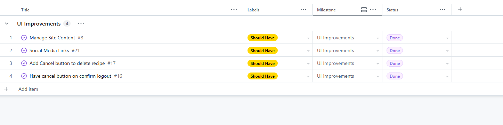
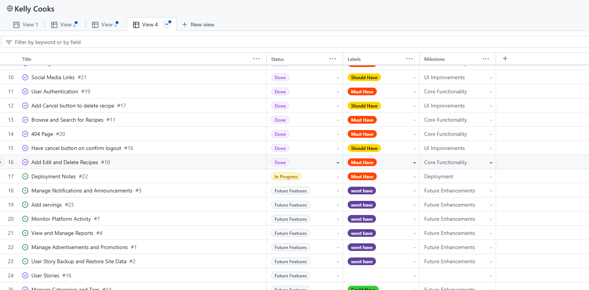
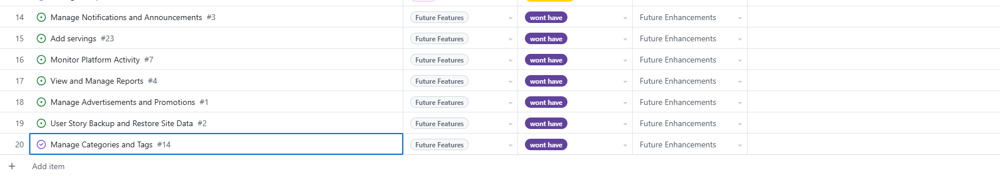

# Scrum-diddly-umptious



Scrum-diddly-umptious provides an easy and engaging way to explore, share, and manage recipes. With a focus on user interaction, the site offers robust CRUD functionalities that allow registered users to create, read, update, and delete recipes. The site is designed with a mobile-first approach to ensure a seamless experience across all devices, utilizing responsive design frameworks like Bootstrap.

**Live Link:** [Hosted Application](https://kellycookspp4-63d6db43ef5f.herokuapp.com/)\
**Github Repository:** [https://github.com/MaireadKelly/Kelly-Cooks]

## Contents

1. [User Experience (UX)](#1-user-experience-ux)
2. [Agile Development](#2-agile-development)
3. [Design](#3-design)
4. [Features](#4-features)
5. [Technologies Used](#5-technologies-used)
6. [Local Development and Deployment](#6-local-development-and-deployment)
7. [Testing](#7-testing)
8. [Credits](#8-credits)

---

## 1. User Experience (UX)

- **Homepage Overview:**
  - **Navigation:**   The navigation menu is featured on all pages to provide a consistent means of navigating the site. The menu provides links to 'Home', 'Recipes', 'New', the 'Register' link switches to 'My Recipes' when the user is logged in, which features a drop-down menu with links to "My Recipes", and "My Favourites", a login link when the user is unauthenticated and a logout link when the user is authenticated. It is fully responsive, collapsing into a navbar toggle button which presents the navigation menu as a dropdown menu. A navbar brand and image features on the left of the navbar, providing an additional link to the 'Home' page.

    
    

    - **Main Section**:  The main section gives a brief description of what the site is all about.  The button in the main section changes from "Sign Up" when no user is logged in to "Browse Recipes" when the user is logged in.

    
    


  - **Featured Recipes:** The homepage displays a selection of featured recipes. Each recipe is presented in a card format, offering a snapshot of the dish with a link to view full details./
  /

  - **Footer:** A Simple Footer with Social Media Links which can be expanded on in future iterations to add contact details, Company Ethos and other useful links/
  


#### **Front-End (User-Facing) Stories**

| **USER STORY**                   | **DETAILS**                                                              | **ACCEPTANCE CRITERIA**                                          |
|----------------------------------|------------------------------------------------------------------------|----------------------------------------------------------------|
| **Submit a Recipe**              | As a user, I can submit a new recipe so that I can share my culinary creations. | A form allows users to submit recipes, which appear in their profile upon submission. |
| **Browse Recipes**               | As a user, I can browse all recipes to find new meal ideas.             | Recipes are listed on the homepage with a preview.            |
| **Review Recicpe**             | As a user, I can rate and comment on recipes to share feedback.         | Only logged-in users can leave reviews. Comments display user names and timestamps. |
| **Edit or Delete Recipe**        | As a user, I can update or delete my own recipes.                        | Users can only edit/delete their own recipes.       |
| **Social Media Links**           | As a user, I want social media links in the footer to follow recipe creators.  | Footer contains links to all relevant social media platforms.  |
| **404 Page**                     | As a user, I want a custom 404 page so that I get clear feedback when a page doesn't exist. | Custom 404 page exists for non-existent URLs. |

#### **Django Admin Panel Stories**

| **USER STORY**                     | **DETAILS** | **ACCEPTANCE CRITERIA** |
|------------------------------------|-------------|--------------------------|
| **Manage Recipes**                 | As an admin, I want to moderate and approve submitted recipes. | Admin panel provides recipe moderation tools. |
| **View and Manage Reports**        | As an admin, I want to review user-generated reports. | Admin dashboard displays reports, allowing action to be taken. |

#### **Future Features**

| **USER STORY**                     | **DETAILS** | **ACCEPTANCE CRITERIA** |
|------------------------------------|-------------|--------------------------|
| **Recipe Collections**             | As a user, I want to create personal recipe collections or meal plans. | Users can create and organize saved recipes. |
| **Social Sharing**                 | As a user, I want to share recipes directly to social media platforms. | A "Share" button allows recipe sharing. |
| **Advanced Filtering**             | As a user, I want to filter recipes based on dietary preferences. | Search filters allow users to narrow down recipe selections. |

---

## 2. Agile Development

This project was developed using Agile methodology which allowed me to iteratively and incrementally build my app, with flexibility to make changes to my design throughout the entire development process.

GitHub Issues and Projects were used to manage the development process. Each part of the app is divided into Epics (Milestones) which are broken down into User Stories (Issues) with Tasks (Acceptance Criteria). An Epic represents a large body of work, such as a feature. The board view of the Project feature was used to display and manage my progress in the form of a 'kanban board'. The user stories were added to the 'Todo' column to be prioritised for development, moved to the 'In Progress' column to indicate development of the feature had begun and finally moved to the 'Done' column when the feature had been implemented and the acceptance criteria had been met.

/

A MOSCOW framework has been utilised. Again using the Kanban Board, all user stories are divided up and prioritised into "Must Have", "Should Have", "Could Have", and "Won't Have"







---

## 3. Design

### Wireframes

- [Homepage](static/documentation/readme/wireframe.webp)
- [Recipe Details](static/documentation/readme/recipe-details.webp)

### UI Colour Palette


---

## 4. Features

### **Existing Features**

- **Navigation:** Users can browse recipes through a structured menu.
- **Recipe Management (CRUD):** Users can create, edit, and delete their own recipes.
- **Comments & Ratings:** Users can interact with content by leaving feedback.
- **User Authentication:** Secure login and registration are implemented.
- **Admin Panel:** Allows Site Administrators to manage content and users.

---

## 5. Technologies Used

- **Languages:** HTML5, CSS3, JavaScript, Python
- **Frameworks:** Django, Bootstrap
- **Databases:** PostgreSQL (hosted on ElephantSQL)
- **Cloud Services:** Cloudinary (image storage)

---

## 6. Local Development and Deployment

### Local Development

1. Clone the repository:

   ```bash
   git clone https://github.com/MaireadKelly/Kelly-Cook.git

   Create a virtual environment and activate it (optional but recommended):

Install dependencies:
bash
Copy
Edit
pip install -r requirements.txt
Run migrations:
bash
Copy
Edit
python manage.py migrate
Create a .env file and configure environment variables (example below):
ini
Copy
Edit
SECRET_KEY=your_secret_key_here
DATABASE_URL=your_database_url_here
DEBUG=True
Start the development server:
bash
Copy
Edit
python manage.py runserver
Deployment
This project is deployed on Heroku using PostgreSQL as the database.

Testing
Testing ensures the application runs smoothly across different environments.

Manual Testing
The project was tested on multiple browsers (Chrome, Firefox, Edge).
Responsiveness was verified on various devices using DevTools.
Forms, authentication, and CRUD functionalities were manually tested.
Automated Testing
Django’s built-in test framework was used for model and view testing.
The pytest package was used for running test cases.
Validation
HTML Validation: W3C Validator
CSS Validation: W3C CSS Validator
JavaScript Validation: JSHint
Python Linting: PEP8 (flake8)
Credits
Code References
Django Documentation: docs.djangoproject.com
Bootstrap Framework: getbootstrap.com
FontAwesome Icons: fontawesome.com
Stack Overflow for debugging and solutions.
Media and Design
Wireframes: Created using Balsamiq and Figma.
Images and Graphics: Some images sourced from Unsplash and Pixabay.
Acknowledgements
Special thanks to Mairead Kelly for project guidance.
Code Institute Mentors for reviewing and feedback.
Fellow developers for collaboration and testing.


bash
Always show details

Copy
python3 -m venv env
source env/bin/activate  # On Windows use: env\Scripts\activate
Install dependencies:

bash
Always show details

Copy
pip install -r requirements.txt
Run migrations:

bash
Always show details

Copy
python manage.py migrate
Create a .env file and configure environment variables (example below):

ini
Always show details

Copy
SECRET_KEY=your_secret_key_here
DATABASE_URL=your_database_url_here
DEBUG=True
Start the development server:

bash
Always show details

Copy
python manage.py runserver
Deployment
This project is deployed on Heroku using PostgreSQL as the database.

7. Testing
Testing ensures the application runs smoothly across different environments.

Manual Testing
The project was tested on multiple browsers (Chrome, Firefox, Edge).
Responsiveness was verified on various devices using DevTools.
Forms, authentication, and CRUD functionalities were manually tested.
Automated Testing
Django’s built-in test framework was used for model and view testing.
The pytest package was used for running test cases.
Validation
HTML Validation: W3C Validator
CSS Validation: W3C CSS Validator
JavaScript Validation: JSHint
Python Linting: PEP8 (flake8)
8. Credits
Code References
Django Documentation: docs.djangoproject.com
Bootstrap Framework: getbootstrap.com
FontAwesome Icons: fontawesome.com
Stack Overflow for debugging and solutions.
Media and Design
Wireframes: Created using Balsamiq and Figma.
Images and Graphics: Some images sourced from Unsplash and Pixabay.
Acknowledgements
Special thanks to Mairead Kelly for project guidance.
Code Institute Mentors for reviewing and feedback.
Fellow developers for collaboration and testing.

