# Kelly Cooks

Kelly Cooks is a recipe‑sharing web application where users can browse, share, edit, review, and favourite recipes. It provides an easy‑to‑use, mobile‑friendly interface for home cooks and food enthusiasts to connect and inspire each other.

---

## Table of Contents
- [UX](#ux)
  - [Project Goals](#project-goals)
  - [Target Audience](#target-audience)
- [Agile Development](#agile-development)
  - [MoSCoW Prioritisation](#moscow-prioritisation)
- [Wireframes](#wireframes)
- [Entity Relationship Diagram](#entity-relationship-diagram)
- [Features](#features)
  - [Implemented Features](#implemented-features)
  - [Login & Logout](#login--logout)
  - [Landing Page](#landing-page)
  - [Recipe Detail Page](#recipe-detail-page)
  - [Add / Edit / Delete Recipe](#add--edit--delete-recipe)
  - [Future Features](#future-features)
- [Technologies Used](#technologies-used)
- [Security & SEO](#security--seo)
- [Testing](#testing)
- [Deployment](#deployment)
- [Credits](#credits)

---

## UX

### Project Goals
- Provide a platform for users to share their own recipes.
- Allow users to browse recipes by others and leave reviews.
- Include user authentication for adding/editing/deleting recipes and reviews.
- Keep the interface clean, intuitive, and mobile‑friendly.

### Target Audience
- People who love cooking and want to share recipes.
- Users looking for cooking inspiration.
- Anyone who wants to interact with a community through recipe reviews and favourites.

---

## Agile Development

Development was managed using a GitHub Projects Kanban Board with columns for **To Do**, **In Progress**, and **Done**. User stories moved through the workflow as they were implemented and tested.

### MoSCoW Prioritisation
**Must Have**
- As a user, I can register for an account so that I can create and manage my own recipes.
- As a user, I can log in and log out so that I can access my account securely.
- As a user, I can add a recipe so that I can share it with others.
- As a user, I can edit my recipe so that I can update or correct it.
- As a user, I can delete my recipe so that I can remove it if necessary.
- As a user, I can browse recipes so that I can find cooking inspiration.
- As a user, I can review recipes so that I can share my feedback.
- As a user, I can mark recipes as favourites so that I can easily find them later.

**Should Have**
- As a user, I can search for recipes so that I can quickly find a recipe by keyword.
- As a user, I can view my own recipes so that I can manage them in one place.
- As a user, I can remove a recipe from my favourites list.

**Could Have**
- As a user, I can filter recipes by category so that I can find recipes by type.
- As a user, I can upload a profile picture to personalise my account.
- As a user, I can share recipes on social media.

---

## Wireframes
- **Home Page**  
  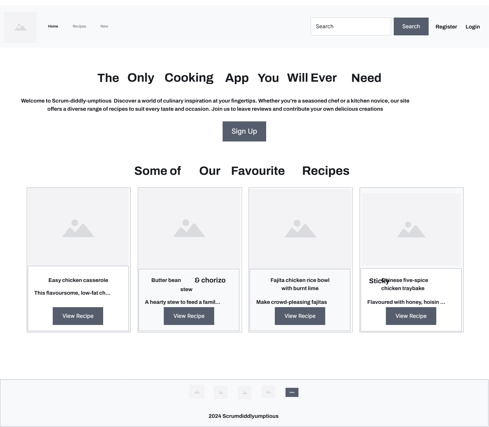
- **Recipe List**  
  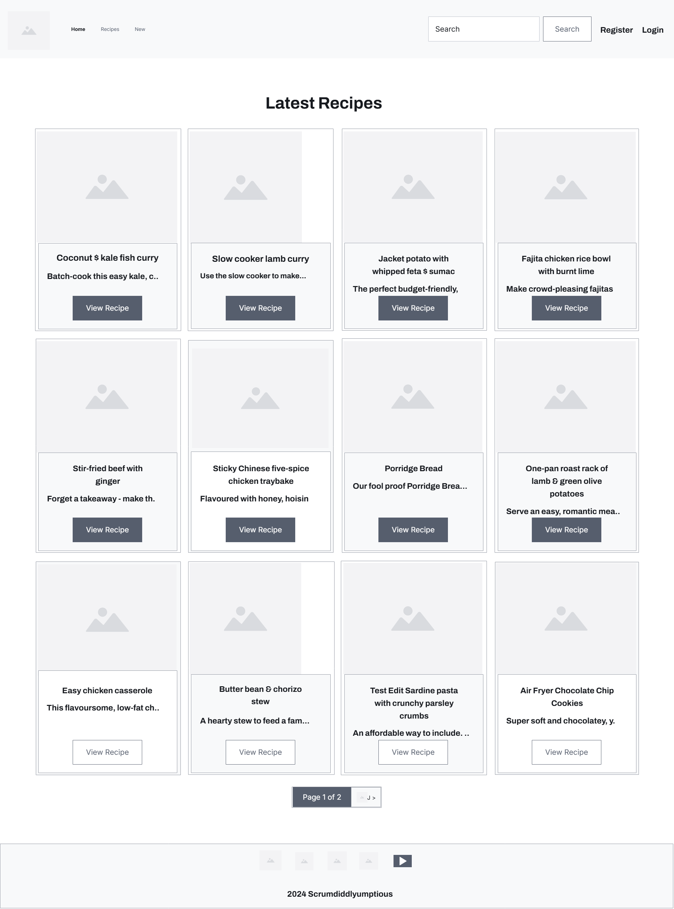
- **Recipe Detail**  
  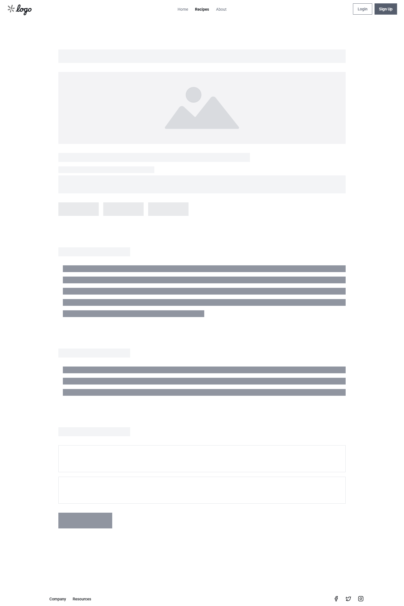

---

## Entity Relationship Diagram
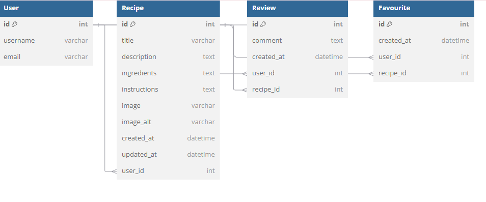

---

## Features

### Implemented Features
- User registration and login/logout functionality.
- Add, edit, and delete own recipes.
- Browse all recipes.
- Leave reviews on recipes.
- Mark recipes as favourites.
- Search functionality.
- Responsive design for mobile, tablet, and desktop.

### User Registration
New users can register an account using the sign‑up form. The system prevents invalid inputs and provides clear error messages.

- **Invalid Email Example**  
  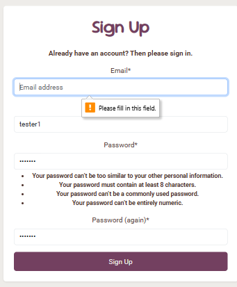

- **Invalid Password Example**  
  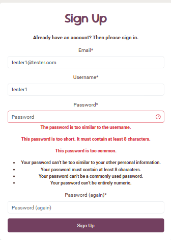

- **Registration Form**  
  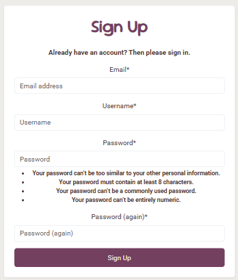

- **Successful Registration**  
  Users are logged in automatically after a successful signup.  
  

### Login & Logout
- **Login form**  
  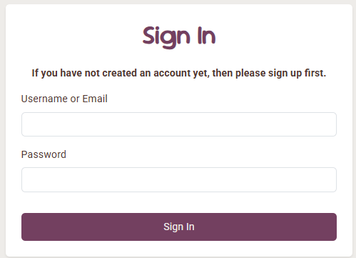

- **Login error** – A clear error message is displayed above the form for invalid credentials.  
  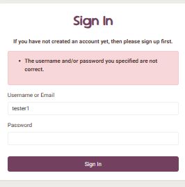

- **Successful login**  
  Redirects to the homepage with a confirmation message.  
  

- **Logout**  
  Confirm logout flow with success feedback.  
  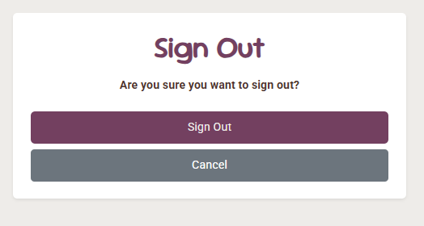  
  

### Landing Page
- **Logged Out View** – prompts sign‑up/login for full access.  
  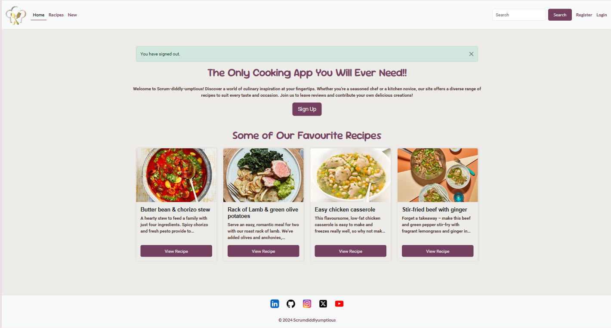
- **Logged In View** – authenticated users can browse recipes directly.  
  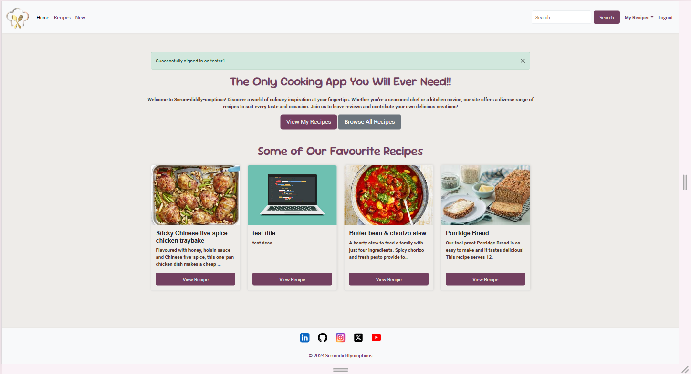

### Recipe Detail Page
- **Owner View** – edit/delete buttons visible to the owner.  
  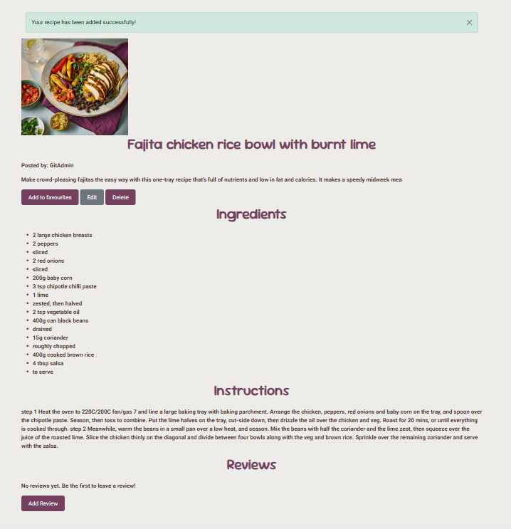
- **Other User View** – favourite and review actions available.  
  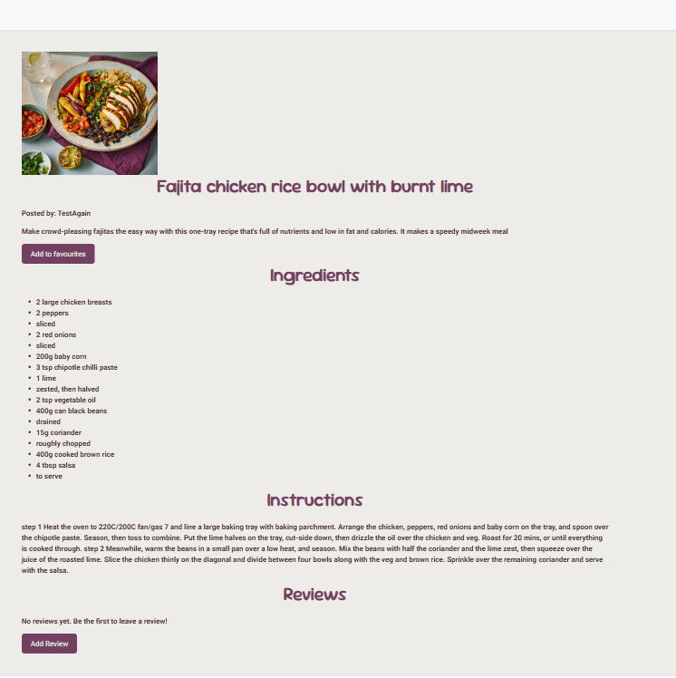

### Add / Edit / Delete Recipe
- **Add Recipe Form**  
  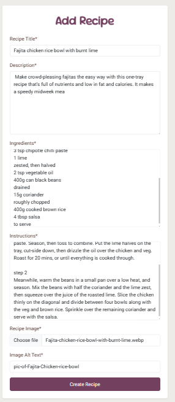
- **Successful Creation**  
  Redirects to detail page with success message.  
  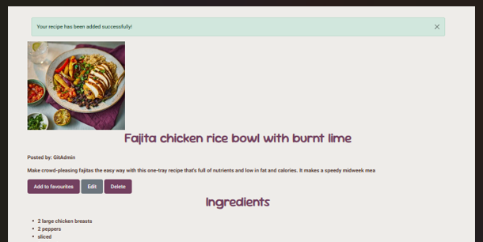
- **Edit Recipe Form**  
  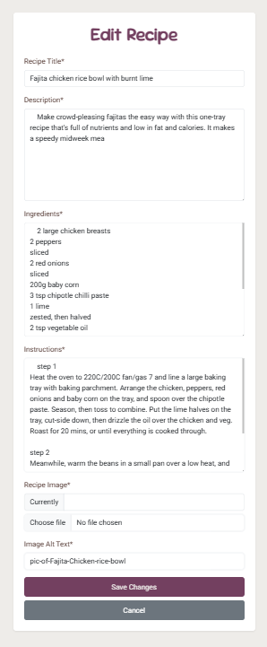
- **Successful Update**  
  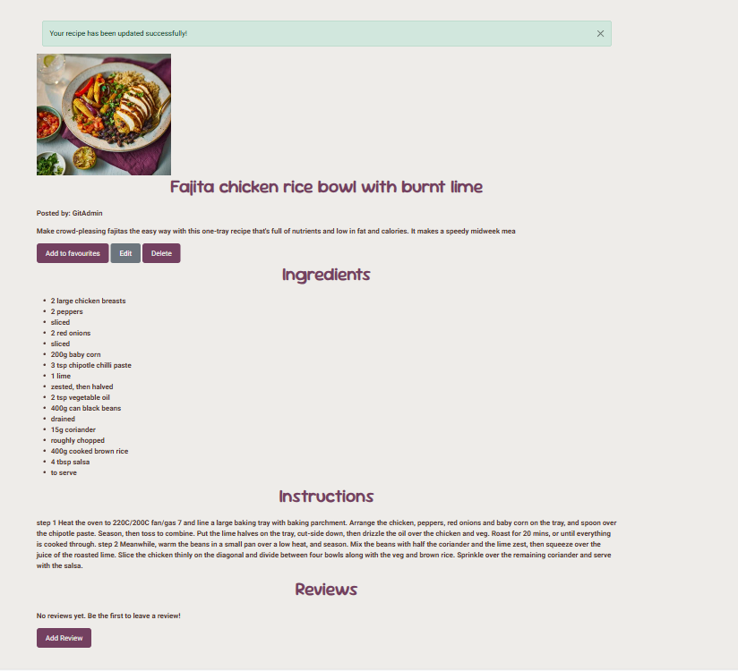
- **Delete Confirmation**  
  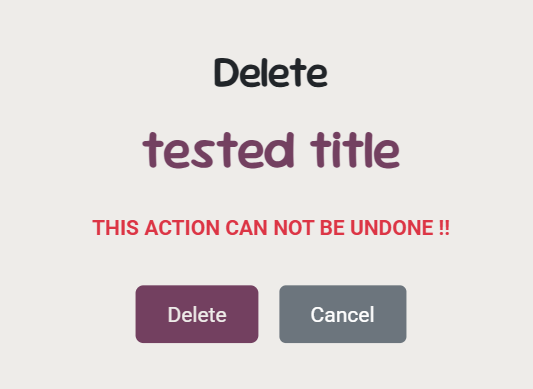
- **Successful Deletion**  
  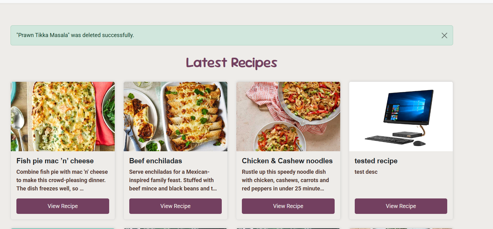

### Future Features
- Advanced filtering by cuisine, dietary needs, and cooking time.
- Profile pictures.
- Social sharing.

---

## Technologies Used
- **Frontend:** HTML5, CSS3, JavaScript, Bootstrap 5
- **Backend:** Python 3, Django (CBVs/FBVs)
- **Database:** PostgreSQL (prod) / SQLite (dev)
- **Media:** Cloudinary
- **Other:** Crispy Forms, djrichtextfield
- **DevOps:** Git/GitHub, Heroku for deployment

---

## Security & SEO
- CSRF protection on forms; authenticated routes gated.
- Ownership checks on edit/delete actions.
- `DEBUG=False` in production; secrets in environment config.
- Descriptive titles and meta descriptions; alt text on imagery.

---

## Testing
A summary of user‑story outcomes appears below. Full details live in [TESTING.md](TESTING.md).

| User Story (selected) | Result |
|---|---|
| Register, Login/Logout | ✅ Pass |
| Add/Edit/Delete Recipe | ✅ Pass |
| Browse & Review Recipes | ✅ Pass |
| Favourites | ✅ Pass |
| Search | ✅ Pass |
| View My Recipes | ✅ Pass |
| Remove Favourite | ✅ Pass |
| Category Filter / Profile Photo / Social Sharing | Not Implemented |

---

## Deployment
The site was deployed to **Heroku**:
1. Create a Heroku app and connect GitHub repo.
2. Add config vars (DB, Cloudinary, Secret Key, Allowed Hosts; set `DEBUG=False`).
3. Push to `main` to trigger build and release.
4. Run migrations and create a superuser.

(For Render, configure a Web Service, Postgres, and equivalent env vars.)

---

## Credits
- Recipe data: user‑generated.
- Favicon: [favicon.io](https://favicon.io)
- Layout inspiration: various recipe websites.
