# Kelly Cooks

Kelly Cooks is a recipe-sharing web application where users can browse, share, edit, review, and favourite recipes. It provides an easy-to-use, mobile-friendly interface for home cooks and food enthusiasts to connect and inspire each other.

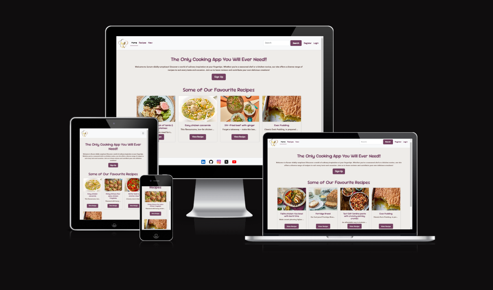

---

## Table of Contents
- [UX](#ux)
  - [Project Goals](#project-goals)
  - [Target Audience](#target-audience)
- [Agile Development](#agile-development)
  - [MoSCoW Prioritisation](#moscow-prioritisation)
- [Wireframes](#wireframes)
- [Data Model](#data-model)
- [Features](#features)
  - [Implemented Features](#implemented-features)
  - [User Registration](#user-registration)
  - [Login & Logout](#login--logout)
  - [Landing Page](#landing-page)
  - [Navigation & Layout](#navigation--layout)
  - [Recipe Detail Page](#recipe-detail-page)
  - [Add / Edit / Delete Recipe](#add--edit--delete-recipe)
  - [Reviews](#reviews)
  - [Favourites & My Recipes](#favourites--my-recipes)
  - [Future Features](#future-features)
- [Defensive Design & Permissions](#defensive-design--permissions)
- [Technologies Used](#technologies-used)
- [Security & SEO](#security--seo)
- [Testing](#testing)
- [Deployment](#deployment)
- [Running Locally](#running-locally)
- [Credits](#credits)

---

## UX

### Project Goals
- Provide a platform for users to share their own recipes.
- Allow users to browse recipes by others and leave reviews.
- Include user authentication for adding/editing/deleting recipes and reviews.
- Keep the interface clean, intuitive, and mobile-friendly.

### Target Audience
- People who love cooking and want to share recipes.
- Users looking for cooking inspiration.
- Anyone who wants to interact with a community through recipe reviews and favourites.

---

## Agile Development

Development was managed using a GitHub Projects Kanban Board with columns for **To Do**, **In Progress**, and **Done**. User stories moved through the workflow as they were implemented and tested.

**Kanban Board:** https://github.com/users/MaireadKelly/projects/5/views/1

### MoSCoW Prioritisation

**Must Have**
- As a user, I can register for an account so that I can create and manage my own recipes.
- As a user, I can log in and log out so that I can access my account securely.
- As a user, I can add a recipe so that I can share it with others.
- As a user, I can edit my recipe so that I can update or correct it.
- As a user, I can delete my recipe so that I can remove it if necessary.
- As a user, I can browse recipes so that I can find cooking inspiration.
- As a user, I can review recipes so that I can share my feedback.
- As a user, I can mark recipes as favourites so that I can easily find them later.

**Should Have**
- As a user, I can search for recipes so that I can quickly find a recipe by keyword.
- As a user, I can view my own recipes so that I can manage them in one place.
- As a user, I can remove a recipe from my favourites list.

**Could Have**
- As a user, I can filter recipes by category so that I can find recipes by type.
- As a user, I can upload a profile picture to personalise my account.
- As a user, I can share recipes on social media.

---

## Wireframes
- **Home Page**  
  
- **Recipe List**  
  
- **Recipe Detail**  
  

---

## Data Model

The application uses a simple, clear schema:

- **User** (Django `auth.User`)
- **Recipe** – belongs to a User; fields include `title`, `description`, `ingredients`, `instructions`, `image`.
- **Review** – belongs to a Recipe and a User; stores `comment` and timestamps.
- **Favourite** – a pair `(user, recipe)` to mark recipes as favourites.

**Relationships**
- User `1-n` Recipe  
- Recipe `1-n` Review  
- User `n-m` Recipe via Favourite (implemented as a model with unique `(user, recipe)`)

---

## Features

### Implemented Features
- User registration and login/logout functionality.
- Add, edit, and delete own recipes.
- Browse all recipes.
- Leave reviews on recipes.
- Mark recipes as favourites.
- Search functionality.
- Responsive design for mobile, tablet, and desktop.

#### User Registration

> Each image links to the full-size version.

**Registration Form**  

**Validation Errors**
| Invalid Email | Invalid Password |
|---|---|
|  |  |

**Successful Registration**  
[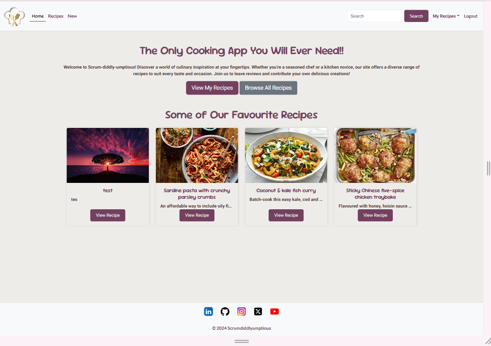](docs/readme/registration-success.png)  
After a successful signup, users are logged in automatically and redirected to the logged-in user’s home page.

  
### Login & Logout
**Login**

> Each image links to the full-size version.

| Login Form | Login Error (invalid credentials) |
|---|---|
|  |  |

- **Successful login**  
  Redirects to the homepage with a confirmation message.  
  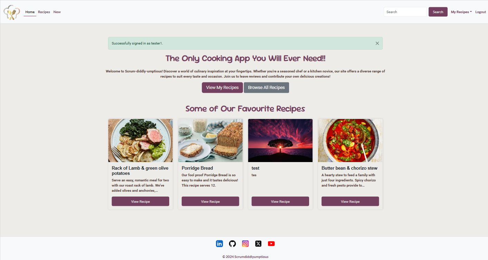

- **Logout**  
  Confirm logout flow with success feedback.  
  
### Landing Page
- **Logged Out View** – prompts sign-up/login for full access.  
  
- **Logged In View** – authenticated users can browse recipes directly.  
  

### Navigation & Layout
Responsive header and footer provide quick access to key areas.
- **Desktop nav**  
  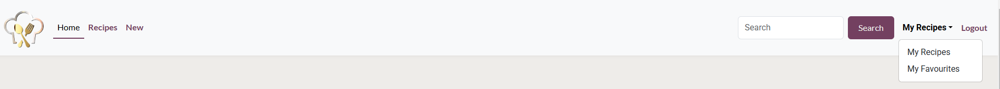
- **Mobile nav**  
  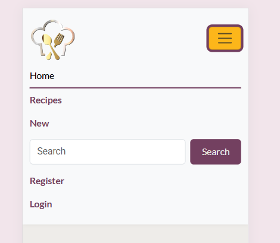

### Recipe Detail Page
- **Owner View** – edit/delete buttons visible to the owner.  
  
- **Other User View** – favourite and review actions available.  
  

### Add / Edit / Delete Recipe
- **Add Recipe Form**  
  
- **Successful Creation**  
  Redirects to detail page with success message.  
  
- **Edit Recipe Form**  
  
- **Successful Update**  
  
- **Delete Confirmation** — On successful delete the user is returned to the recipes page.  
  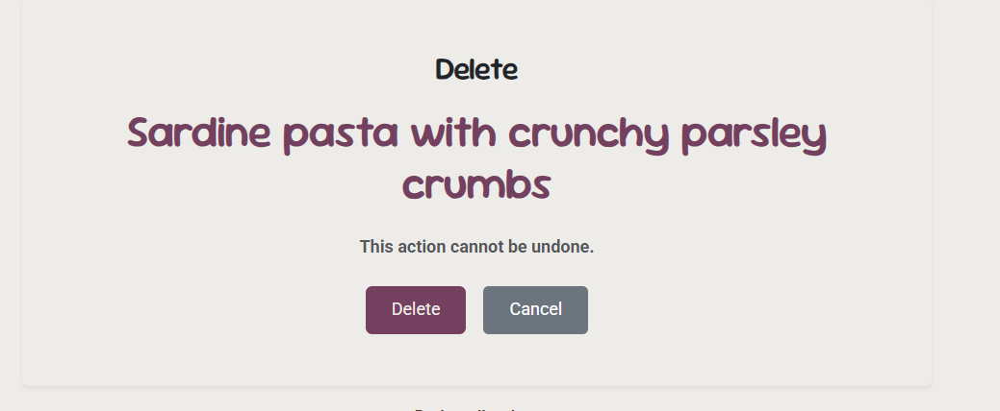

### Edit and Delete Permissions

- The **Edit** and **Delete** buttons only appear for the recipe owner (or an admin user).  
- This prevents other users from accessing update or delete routes directly.  
- This conditional rendering is intentional and follows Django best practice for secure CRUD design.

### Reviews
Users can leave feedback on recipes.
- **Add review**  
  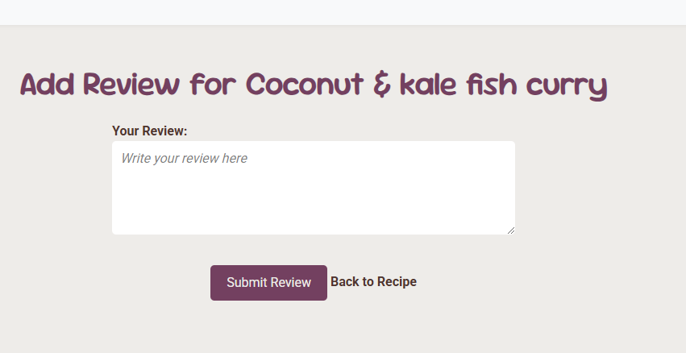

### Favourites & My Recipes

> Each image links to the full-size version.

**Toggle on (recipe detail)**
| Before (OFF) | After (ON with success message) |
|---|---|
| [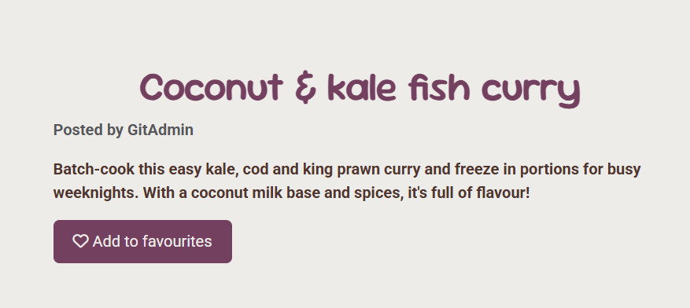](docs/readme/favourite-toggle-off.png) | [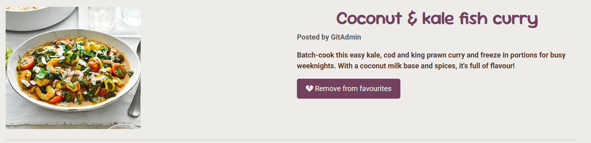](docs/readme/favourite-toggle-on.png) |

**Favourites list (now includes recipe)**
[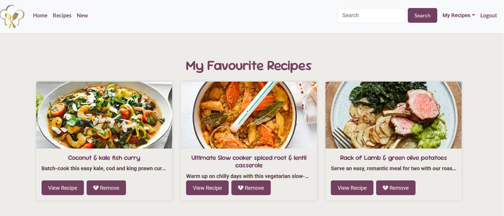](docs/readme/favourites-list-added.png)

 
> **Favourites list (removed)**  
> [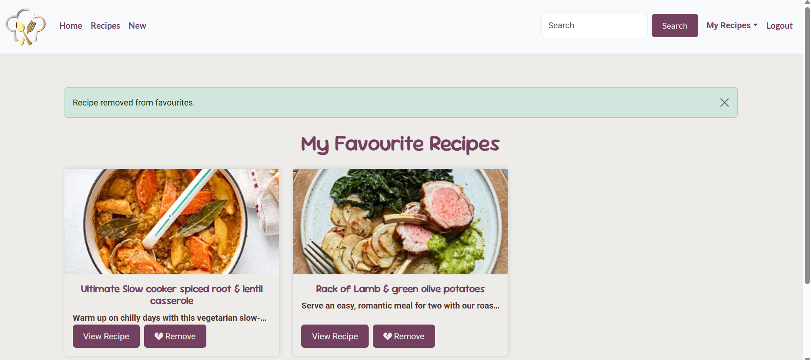](docs/readme/favourites-list-removed.png)

**My Recipes**
[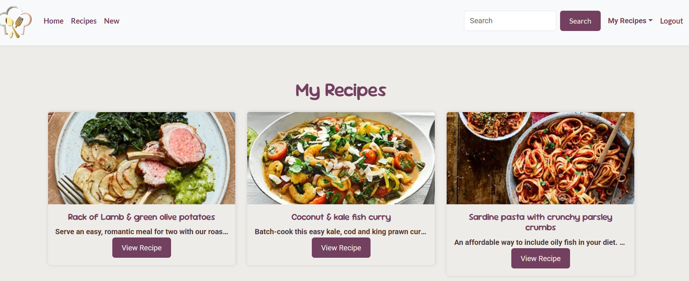](docs/readme/my-recipes.png)

### Future Features
- Advanced filtering by cuisine, dietary needs, and cooking time.
- Profile pictures.
- Social sharing.

---

## Defensive Design & Permissions

- **Auth-gated actions**: Adding recipes, posting/editing/deleting reviews, and toggling favourites require login.
- **Ownership checks**: Only the **recipe owner** can edit or delete a recipe. Non-owners are redirected back to the recipe detail with a clear error message.
- **Review ownership**: Only the **review author** can edit/delete their review.
- **Safe delete**: Deleting a recipe shows a confirmation screen; on success, the app redirects to the recipe list with a success message.
- **UX niceties**:
  - Landing page hides the **Sign-Up** CTA for authenticated users.
  - All success/error states use Bootstrap alerts so the user always sees the outcome.

---

## Technologies Used

**Frontend**: HTML5, CSS3, Bootstrap 5  
**Backend**: Python 3, Django  
**Auth**: django-allauth  
**Forms**: django-crispy-forms  
**Storage**: Cloudinary (images), `cloudinary_storage`  
**Static files**: WhiteNoise (compressed manifest)  
**Deployment**: Heroku + Gunicorn  

---

## Security & SEO
- CSRF protection on forms; authenticated routes gated.
- Ownership checks on edit/delete actions.
- `DEBUG=False` in production; secrets in environment config.
- **HTTPS enforced** for Cloudinary assets.
- Descriptive titles and meta descriptions; alt text on imagery.

---

## Testing

- **HTML**: All key pages pass W3C HTML validation.  
- **CSS**: Passes Jigsaw CSS validation.  
- **Python**: PEP8 compliance.  
- **Lighthouse**: Performance and Accessibility are strong; Best Practices improved after enforcing HTTPS for Cloudinary assets.

➡ Full evidence and screenshots are in **[TESTING.md](TESTING.md)** (HTML/CSS/Python/Lighthouse, CRUD checks, and known issues).

---

### Resubmission Improvements

Following assessor feedback, the following issues were resolved and retested:

- ✅ **CRUD operations:** All create, edit, and delete functionality now completes successfully with appropriate user messages.  
- ✅ **Delete confirmation:** Added a proper confirmation page with a success message and redirect to the recipe list.  
- ✅ **Feedback messages:** All CRUD, favourites, and review actions now use Django messages for success/error feedback.  
- ✅ **Namespacing:** All URLs now use the correct `recipes:` namespace, preventing reverse-match errors.  
- ✅ **Broken links:** All placeholder `href="#"` values were replaced with working links.  
- ✅ **Header dropdown:** Now fully W3C-compliant and validator friendly.  
- ✅ **Testing:** Full CRUD and navigation retested; screenshots captured below.  
- ✅ **Minor documentation fixes:** Updated README to reflect current behaviour (users can currently review a recipe more than once).

### Updated Evidence Screenshots

| Action | Screenshot |
|--------|-------------|
| Add Recipe |  |
| Edit Recipe |  |
| Delete Confirmation |  |
| Delete Success |  |
| Add Review | 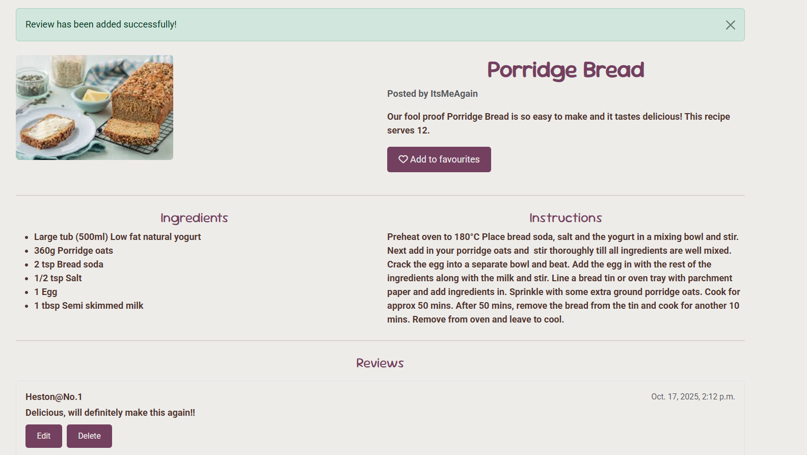 |
| Edit Review | 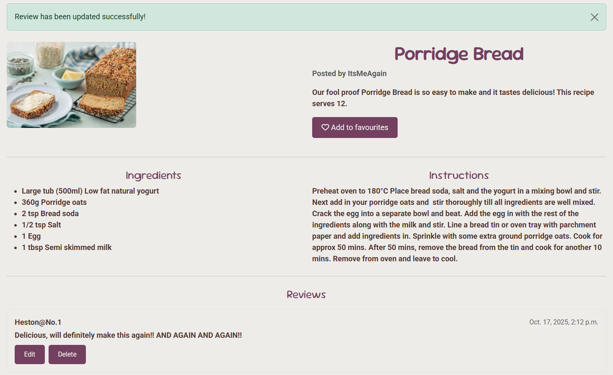 |
| Delete Review | 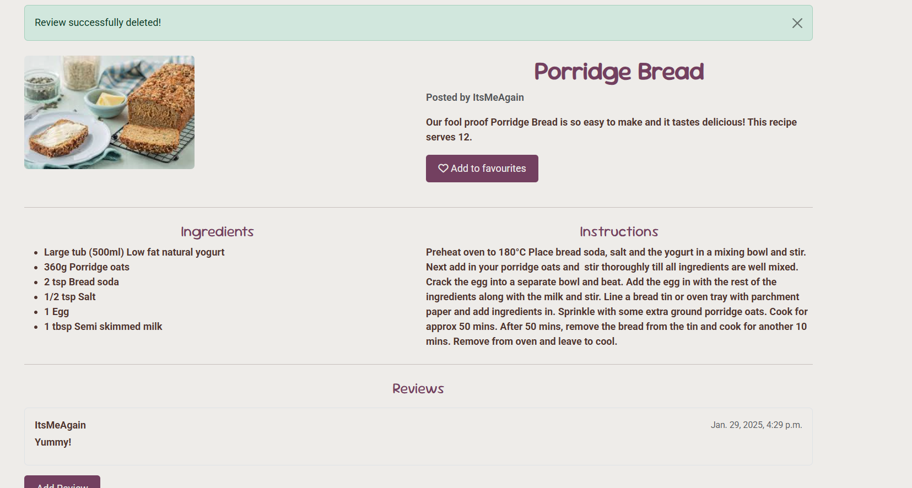 |
| Favourite Added | 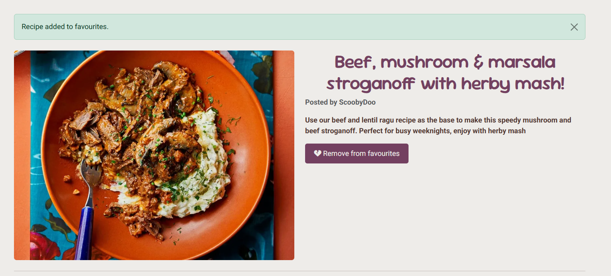 |
| Favourite Removed | 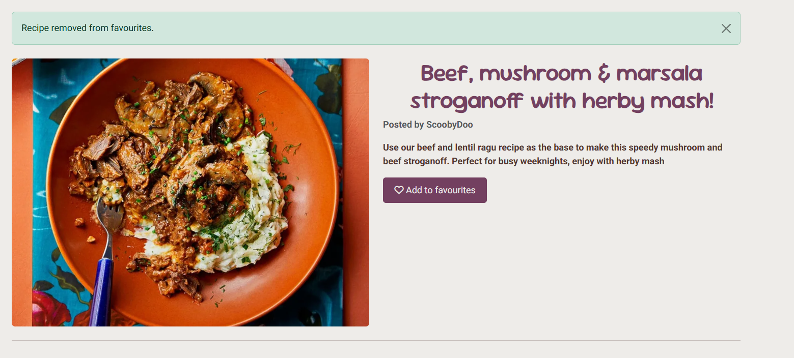 |
| My Recipes Dropdown | 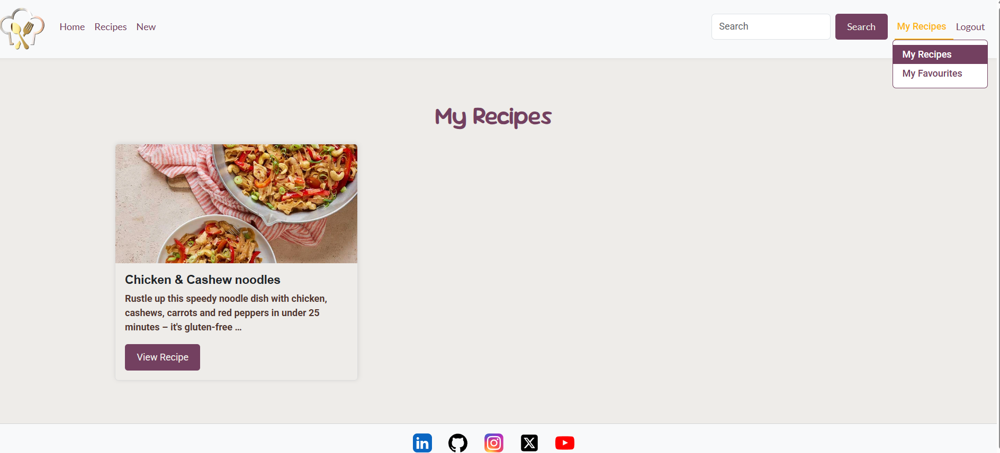 |

All improvements were validated and re-deployed to Heroku.  
The live version behaves identically to the local development build.

## Deployment

The project was deployed using **Heroku** following these steps:

1. In the Heroku Dashboard, click **New → Create new app** and choose a unique name.
2. In **Settings → Config Vars**, add the following keys:
   - `DATABASE_URL` – Postgres connection string  
   - `CLOUDINARY_URL` – from Cloudinary dashboard  
   - `SECRET_KEY` – secure random key  
   - `DISABLE_COLLECTSTATIC=1` (only for initial build if needed)
   - `ALLOWED_HOSTS` – app’s Heroku domain
3. In the **Deploy** tab:
   - Choose **GitHub → Connect to GitHub**.
   - Search for your repository and connect it.
   - Enable **Automatic Deploys** from the `main` branch.
4. Once deployed, run `python manage.py createsuperuser` on Heroku (via the console) to access the admin.
5. Visit the live link:  
   **https://kelly-cooks.herokuapp.com/** (or your app’s domain)

### Additional Deployment Notes
- The live app mirrors the development branch (no missing functionality).
- All environment variables are hidden; `DEBUG=False` for security.
- Static and media files are hosted via **Cloudinary** and **WhiteNoise**.
- The database is provided by **Heroku Postgres**.
- Code validated before final deploy; all CRUD and feedback functionality retested.

## Running Locally

~~~bash
git clone <repo-url>
cd Kelly-Cooks
python -m venv .venv
# Windows:
#   .venv\Scripts\activate
# macOS/Linux:
#   source .venv/bin/activate
pip install -r requirements.txt
cp .env.example .env   # or create .env as below
python manage.py migrate
python manage.py createsuperuser
python manage.py runserver
~~~

**.env keys (sample)**
- `SECRET_KEY=...`
- `DEBUG=True` *(local only)*
- `DATABASE_URL=...` *(if using Postgres locally; otherwise SQLite is fine)*
- `CLOUDINARY_URL=cloudinary://<key>:<secret>@<cloud_name>`
- `ALLOWED_HOSTS=localhost,127.0.0.1`

## Credits

### Content & Data
- **Recipe inspiration**: Some recipes and ideas were inspired by [BBC Good Food](https://www.bbcgoodfood.com/). 

- **User-generated content**: Recipes, titles, and reviews created during testing are user-generated for the purposes of this educational project.

### Design & Media
- **Mockups / marketing images**: Created in [Canva](https://www.canva.com/).
- **Icons**: [Font Awesome](https://fontawesome.com/) (CDN) — used for UI icons where applicable.
- **Images hosting / transforms**: [Cloudinary](https://cloudinary.com/) via `cloudinary_storage`.

### Frameworks & Libraries
- **Django** — core web framework.
- **django-allauth** — authentication & account management.
- **django-crispy-forms** — improved form rendering.
- **Bootstrap 5** — layout & components (CSS + bundle JS).
- **WhiteNoise** — static files (compressed manifest).
- **Gunicorn** — WSGI server for production.
- **Heroku** — deployment hosting.
- **djrichtextfield** — rich text editor.  

### Project Scaffolding
- **Starter template**: Code Institute’s Full Template (repo generated from CI’s base template).

### Tools & Validation
- **W3C HTML** validator — markup validation.
- **W3C Jigsaw** CSS validator — CSS validation.
- **PEP8** validator — Python style checks.
- **Lighthouse** — performance, accessibility & best-practices audit.

### Acknowledgements
- **Mentor/Reviewers** — for guidance and feedback.
- **ChatGPT (OpenAI)** — used to assist with debugging, refactoring, Lighthouse improvements (HTTPS/mixed-content), and documentation polish during development.

### Licensing & Attribution Notes
- This project is for **educational purposes**. Where third-party resources (e.g., BBC Good Food recipes) informed content, they are acknowledged above.  
- Icons and fonts are used under the terms of their respective licenses. Ensure any new assets added respect their original licenses.

