# Kelly Cooks – Testing Documentation

This file contains full details of the testing carried out on the **Kelly Cooks** project.

---

## **HTML Validation**

All key pages were validated using the [W3C Markup Validation Service](https://validator.w3.org/).  
The following table summarises results:

| Page                             | URL Example                 | Result |
|----------------------------------|-----------------------------|--------|
| Landing Page                     | `/`                         | ✅ Pass |
| Recipe List                      | `/recipes/`                 | ✅ Pass |
| Recipe Detail                    | `/recipes/<id>/`            | ✅ Pass |
| Add Recipe                       | `/recipes/add/`             | ✅ Pass |
| Edit Recipe                      | `/recipes/edit/<id>/`       | ✅ Pass |
| Delete Confirmation              | `/recipes/delete/<id>/`     | ✅ Pass |
| My Recipes                       | `/recipes/my-recipes/`      | ✅ Pass |
| Favourites                       | `/recipes/favourites/`      | ✅ Pass |
| Add Review                       | `/recipes/<id>/review/`     | ✅ Pass |

### W3C HTML Validation (Screenshots)

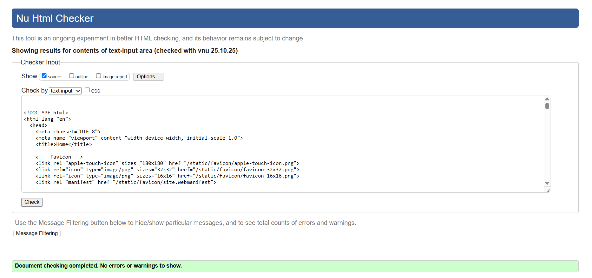
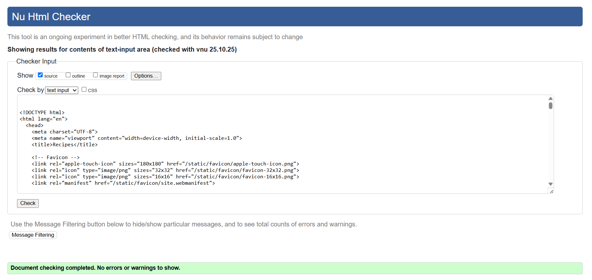
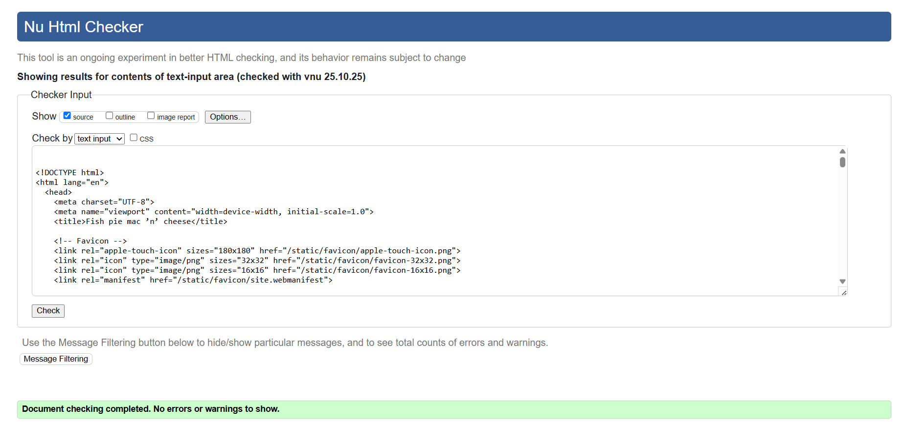
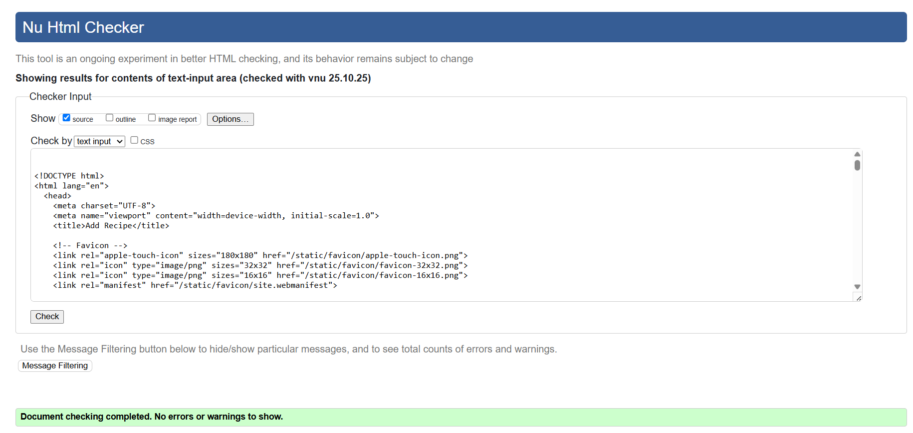
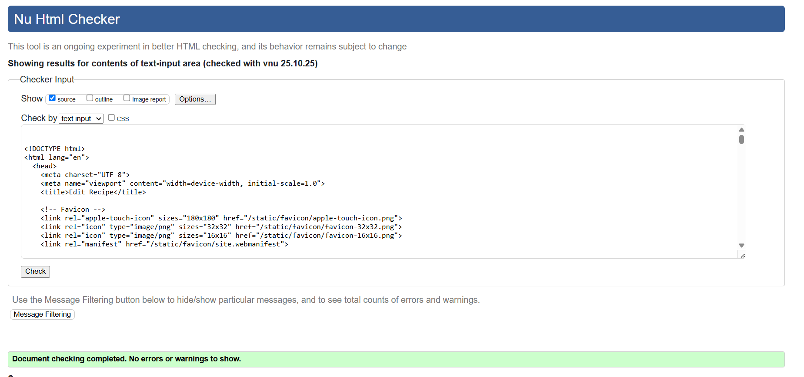
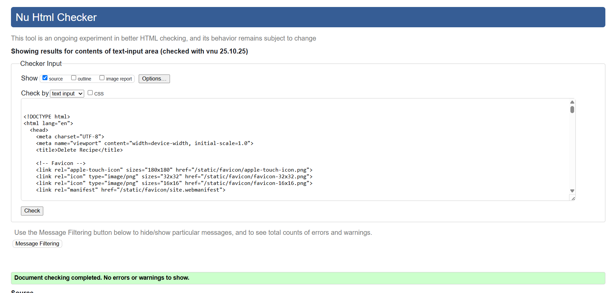
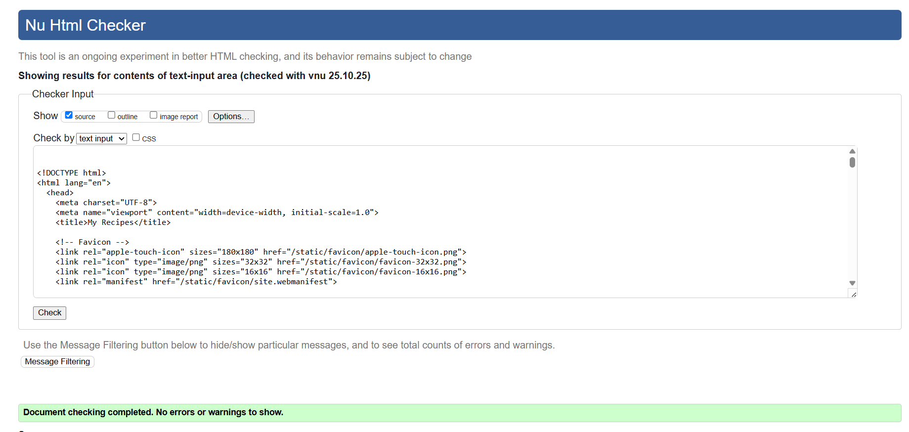
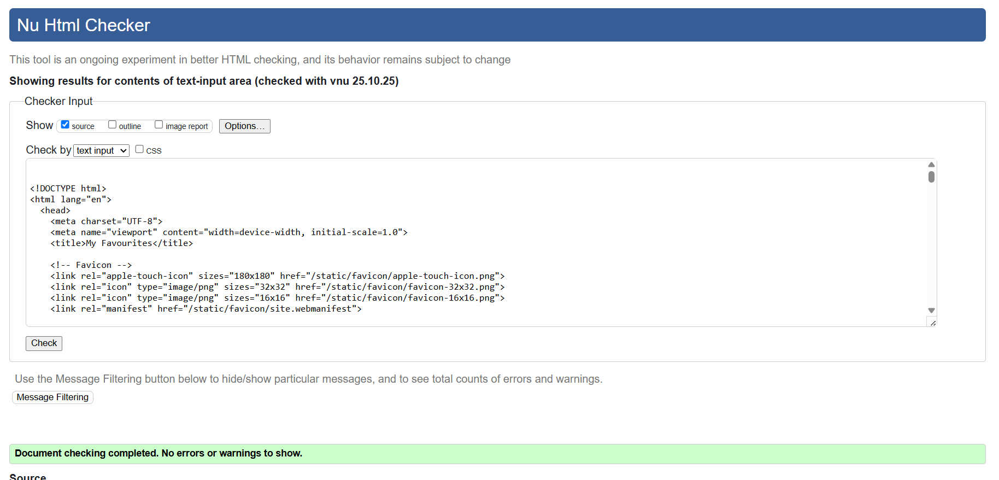
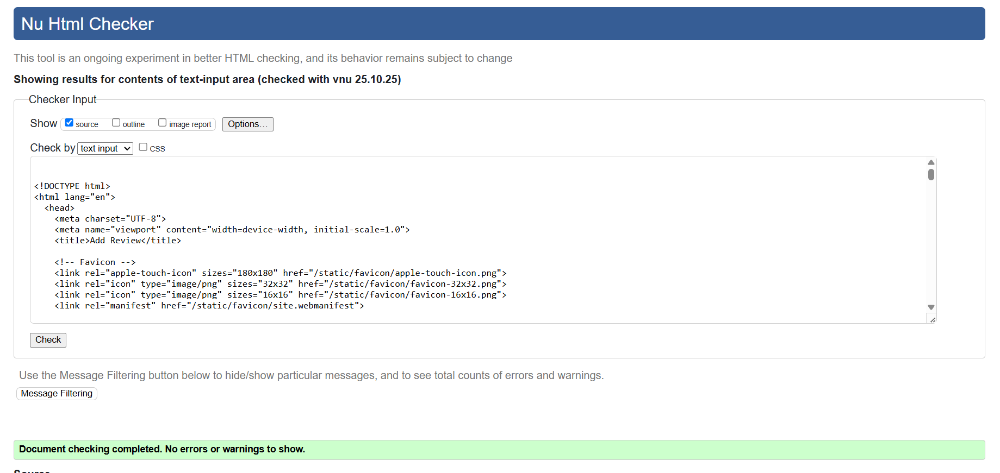

---

## **CSS Validation**

CSS was validated using the [W3C Jigsaw CSS Validation Service](https://jigsaw.w3.org/css-validator/).  
Result: ✅ Pass with no errors.

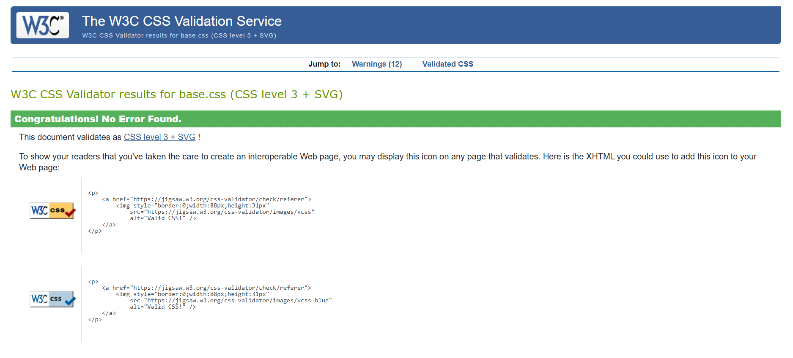

---

## **Python (PEP8) Validation**

All first-party Python files were tested using the Code Institute PEP8 linter  
(https://pep8ci.herokuapp.com/). Auto-generated files (migrations, `__pycache__`, `.venv/`, `.vscode/`) were excluded.

**Files tested**
- `manage.py`
- `main/` → `__init__.py`, `settings.py`, `urls.py`, `wsgi.py`, `asgi.py`
- `home/` → `__init__.py`, `apps.py`, `admin.py`, `models.py`, `views.py`, `urls.py`, `tests.py`
- `recipes/` → `__init__.py`, `apps.py`, `admin.py`, `forms.py`, `models.py`, `views.py`, `urls.py`, `tests.py`

**Results**
- ✅ All files passed PEP8 validation with no significant errors.

### PEP8 Validation — Evidence

> Each image links to the full-size version.

| `manage.py` | `main/` |
|---|---|
| [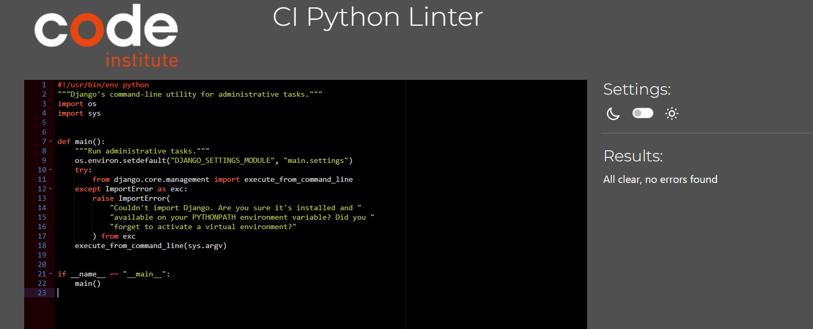](docs/validation/python-validation-manage.png) | [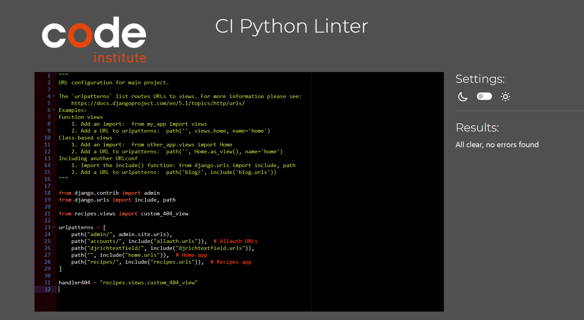](docs/validation/python-validation-main.png) |

| `home/` | `recipes/` |
|---|---|
| [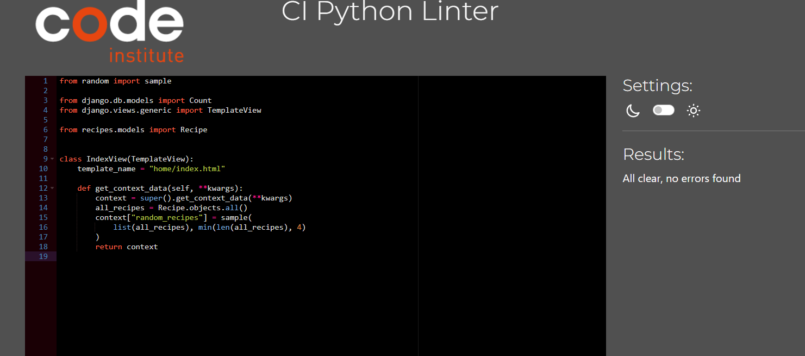](docs/validation/python-validation-home.png) | [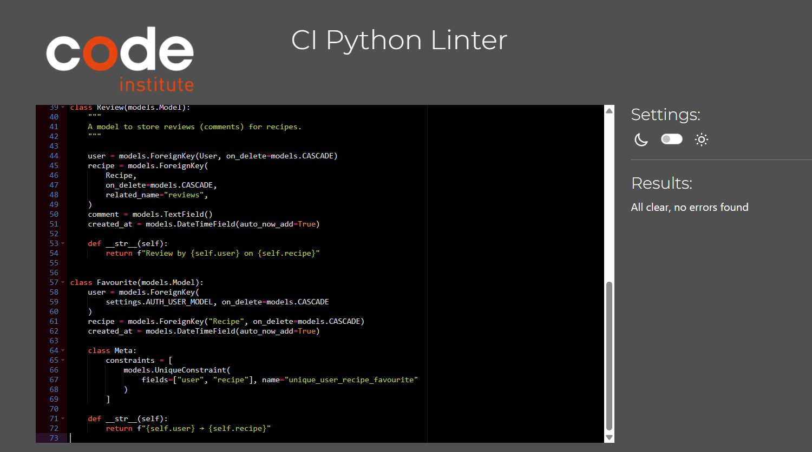](docs/validation/python-validation-recipes.png) |

---

## **Lighthouse Testing**

Performance and accessibility were tested using Google Chrome DevTools Lighthouse audit.

### **Desktop**

### **Mobile**

**Note:** Best Practices improved after enforcing HTTPS for Cloudinary assets (`cloudinary.config(secure=True)` and `CLOUDINARY_SECURE=True`). Mixed-content warnings were re-tested and no longer appear.

---

## 🧭 Browser and Device Testing

All testing was performed on the deployed version of the site to ensure full functionality, responsiveness, and consistent styling across browsers and devices. The goal was to confirm that all key elements — including navigation, forms, responsive layouts, images, and Cloudinary optimizations — worked as expected.

Testing was completed using a combination of real devices and Chrome DevTools responsive simulation.

| Browser | Device Type | Test Focus | Result | Screenshot |
|----------|--------------|-------------|----------|-------------|
| Chrome | Desktop | Verified header, hero banner, recipe cards, and footer render correctly. | ✅ Pass | `docs/testing/chrome-desktop.png` |
| Firefox | Desktop | Verified typography, layout alignment, and search functionality. | ✅ Pass | `docs/testing/firefox-desktop.png` |
| Edge | Desktop | Confirmed links, dropdown menus, and footer icons display correctly. | ✅ Pass | `docs/testing/edge-desktop.png` |
| Chrome (Mobile View) | Android Simulator | Checked responsive navbar toggle, recipe grid, and image scaling. | ✅ Pass | `docs/testing/chrome-mobile.png` |
| Safari (Mobile) | iPhone | Checked touch targets, buttons, and responsive layout on smaller screens. | ✅ Pass | `docs/testing/safari-mobile.png` |

### Summary
The site performed consistently across all browsers and device types. The responsive design using Bootstrap 5 ensured smooth adaptation to varying screen sizes, while the optimized Cloudinary image transformations significantly improved mobile performance and loading times.  
No visual layout issues, functionality errors, or navigation problems were detected. All pages remained fully responsive, accessible, and visually consistent throughout testing.

### Screenshot Evidence

Below are the final cross-browser and device screenshots taken from the deployed site.  
Each demonstrates consistent layout, responsive behavior, and fully functional interface elements across multiple platforms.

| Screenshot | Description |
|-------------|-------------|
| `docs/testing/chrome-desktop.png` | **Chrome (Desktop):** Displays the complete homepage layout, including header, hero banner, recipe cards, and footer with social media icons. Demonstrates that all major elements render cleanly and proportionally. |
| `docs/testing/firefox-desktop.png` | **Firefox (Desktop):** Shows the main Recipes listing page. Confirms correct grid alignment, image display, and consistent spacing between recipe cards. |
| `docs/testing/edge-desktop.png` | **Edge (Desktop):** Highlights the footer section and dropdown navigation to verify link styling, icon rendering, and hover/focus interactions. |
| `docs/testing/chrome-mobile.png` | **Chrome (Mobile View):** Captured in DevTools responsive mode. Demonstrates correct navbar collapse into a hamburger icon, readable hero text, and vertically stacked recipe cards. |
| `docs/testing/safari-mobile.png` | **Safari (Mobile):** Displays a single recipe detail view on iPhone, confirming that buttons, text, and image scaling remain clear and accessible on smaller screens. |

All pages retained consistent color schemes, typography, and spacing. Buttons and form inputs remained fully clickable/tappable on all tested browsers and devices.

### Summary
Cross-browser testing confirmed that the site performs and renders consistently in Chrome, Firefox, Edge, and Safari, across both desktop and mobile environments.  
The responsive Bootstrap layout and Cloudinary image optimizations ensured fast loading and proper scaling on all viewports.  
No styling anomalies, overlapping content, or functionality issues were identified during testing.

---

## **Manual Feature Tests**

### **Authentication**
| Scenario | Steps | Expected | Result |
|---|---|---|---|
| Register new account | Visit Sign Up → submit valid details | Account created, user logged in | ✅ |
| Register invalid email | Submit invalid email | Inline error shown, no account created | ✅ |
| Login success | Visit Login → submit valid credentials | Logged in with success message | ✅ |
| Login failure | Submit wrong password | Error message above the form | ✅ |
| Logout | Click Logout | Session cleared, success message | ✅ |

### **Authentication & Access Control (extra)**
| Scenario | Steps | Expected | Result |
|---|---|---|---|
| Unauthenticated: Add/Edit/Delete | Logged out → visit `/recipes/add/`, `/recipes/edit/<id>/`, `/recipes/delete/<id>/` | Redirects to Login with `?next=...` | ✅ |
| Custom 404 page | Visit a non-existent URL, e.g. `/recipes/9999999/` (if not present) | Branded 404 template is shown (no debug info) | ✅ |

### Custom 404 Page — Evidence

The application serves a branded 404 page with no debug information.

### **CRUD – Recipes**
| Scenario | Steps | Expected | Result |
|---|---|---|---|
| Create recipe | Add Recipe → submit valid form | Redirect to recipe detail with success message | ✅ |
| Edit own recipe | Detail → Edit → submit | Redirect to detail with success message | ✅ |
| Cancel edit | Detail → Edit → **Cancel** | Return to detail, no changes | ✅ |
| Delete own recipe | Detail → Delete → confirm | Redirect to list with success message | ✅ |

### **Defensive Design (Permissions)**
| Scenario | Steps | Expected | Result |
|---|---|---|---|
| Non-owner: edit | Login as other user → visit `/recipes/edit/<id>/` | Error message, redirect to recipe detail (no 403 page) | ✅ |
| Non-owner: delete | Login as other user → visit `/recipes/delete/<id>/` | Error message, redirect to recipe detail (no debug page) | ✅ |

### **Reviews**
| Scenario | Steps | Expected | Result |
|---|---|---|---|
| Add review | Detail → Add Review → submit | Redirect to detail with success message; review visible | ✅ |
| Edit own review | On own review → Edit → submit | Redirect to detail with success message | ✅ |
| Delete own review | On own review → Delete | Redirect to detail with success message; review removed | ✅ |

### **Favourites & Lists**
| Scenario | Steps | Expected | Result |
|---|---|---|---|
| Toggle favourite on | Detail → “Add to favourites” | Success message; item appears in `/recipes/favourites/` | ✅ |
| Toggle favourite off | Detail → “Remove from favourites” | Success message; item removed from favourites | ✅ |
| My Recipes | Visit `/recipes/my-recipes/` | Only the user’s recipes are listed | ✅ |
| Anonymous user clicks "Add to favourites" | Visit /recipes/<id>/ while logged out → click Add to favourites | Redirects to Login with ?next=…; after login returns to the recipe | ✅ |

---

## **User Story Testing**

> This table mirrors the README and includes **MoSCoW priorities**. Full evidence and screenshots are provided above.

| MoSCoW Priority | User Story                                                                 | Test Result |
|-----------------|-----------------------------------------------------------------------------|-------------|
| **Must Have**   | As a user, I can register for an account so that I can create and manage my own recipes. | ✅ Pass |
| **Must Have**   | As a user, I can log in and log out so that I can access my account securely. | ✅ Pass |
| **Must Have**   | As a user, I can add a recipe so that I can share it with others. | ✅ Pass |
| **Must Have**   | As a user, I can edit my recipe so that I can update or correct it. | ✅ Pass |
| **Must Have**   | As a user, I can delete my recipe so that I can remove it if necessary. | ✅ Pass |
| **Must Have**   | As a user, I can browse recipes so that I can find cooking inspiration. | ✅ Pass |
| **Must Have**   | As a user, I can review recipes so that I can share my feedback. | ✅ Pass |
| **Must Have**   | As a user, I can mark recipes as favourites so that I can easily find them later. | ✅ Pass |
| **Should Have** | As a user, I can search for recipes so that I can quickly find a recipe by keyword. | ✅ Pass |
| **Should Have** | As a user, I can view my own recipes so that I can manage them in one place. | ✅ Pass |
| **Should Have** | As a user, I can remove a recipe from my favourites list. | ✅ Pass |
| **Could Have**  | As a user, I can filter recipes by category so that I can find recipes by type. | Not Implemented |
| **Could Have**  | As a user, I can upload a profile picture to personalise my account. | Not Implemented |
| **Could Have**  | As a user, I can share recipes on social media. | Not Implemented |

---

## **Bugs & Fixes**

- **Edit Recipe “Cancel” loop** – Cancel now returns to **detail** (was looping back to edit).  
- **Favourites clarity** – Toggling favourites shows a success message; items appear/remove in **My Favourites**.  
- **Static files paths** – Corrected in `base.html` to load favicon and CSS correctly.  
- **Mixed content (Lighthouse)** – Enforced HTTPS for Cloudinary (`cloudinary.config(secure=True)`, `CLOUDINARY_SECURE=True`).

---

## **Conclusion**

All functional and non-functional requirements were met.  
Full validation evidence and screenshots are stored in `docs/validation/` and `docs/testing/`.

