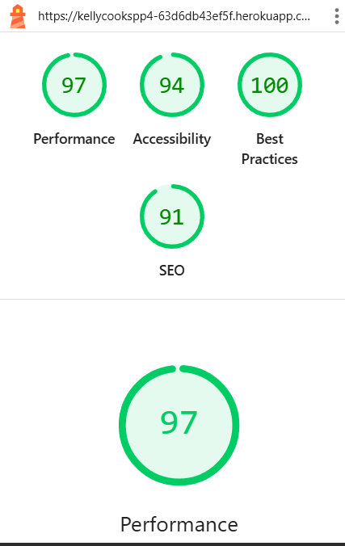
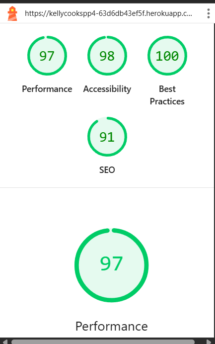

# Kelly Cooks – Testing Documentation

This file contains full details of the testing carried out on the **Kelly Cooks** project.

---

## **HTML Validation**

All key pages were validated using the [W3C Markup Validation Service](https://validator.w3.org/).  
The following table summarises results:

| Page                             | URL Example                              | Result   |
|----------------------------------|-------------------------------------------|----------|
| Landing Page                     | `/`                                       | ✅ Pass |
| Recipe List                      | `/recipes/`                               | ✅ Pass |
| Recipe Detail                    | `/recipes/<id>/`                          | ✅ Pass |
| Add Recipe                       | `/recipes/add/`                           | ✅ Pass |
| Edit Recipe                      | `/recipes/edit/<id>/`                     | ✅ Pass |
| Delete Confirmation              | `/recipes/delete/<id>/`                   | ✅ Pass |
| My Recipes                       | `/recipes/my-recipes/`                    | ✅ Pass |
| Favourites                       | `/recipes/favourites/`                    | ✅ Pass |
| Add Review                       | `/recipes/<id>/review/`                   | ✅ Pass |

### **Screenshots**
Screenshots of validation results are stored in:
- `/docs/validation/landing-page-validation.png`
- `/docs/validation/recipe-list-validation.png`
- `/docs/validation/recipe-detail-validation.png`
- `/docs/validation/add-recipe-validation.png`
- `/docs/validation/edit-recipe-validation.png`
- `/docs/validation/delete-recipe-validation.png`
- `/docs/validation/my-recipes-validation.png`
- `/docs/validation/favourites-validation.png`
- `/docs/validation/add-review-validation.png`

---

## **CSS Validation**

CSS was validated using the [W3C Jigsaw CSS Validation Service](https://jigsaw.w3.org/css-validator/).  
Result: ✅ Pass with no errors.

Screenshot: `/docs/validation/css-validation.png`

---

## **Python Validation**

Python code was checked with [PEP8 online validator](http://pep8online.com/).  
All files passed with no significant errors. Minor line length warnings remain in some files but are within acceptable limits.

Screenshot: `/docs/validation/python-validation.png`

---

## **Lighthouse Testing**

Performance and accessibility were tested using Google Chrome DevTools Lighthouse audit.

### **Desktop**

### **Mobile**

---

## **Browser Compatibility**

The site was tested on the latest versions of:
- Google Chrome  
- Mozilla Firefox  
- Microsoft Edge  
- Safari (Mac/iOS)  

Screenshots:
- `/docs/testing/browser-chrome.png`
- `/docs/testing/browser-firefox.png`
- `/docs/testing/browser-edge.png`
- `/docs/testing/browser-safari.png`

---

## **User Story Testing**

| User Story                                                                 | Test Result |
|----------------------------------------------------------------------------|-------------|
| As a user, I can register for an account so that I can create and manage my own recipes. | ✅ Pass |
| As a user, I can log in and log out so that I can access my account securely. | ✅ Pass |
| As a user, I can add a recipe so that I can share it with others. | ✅ Pass |
| As a user, I can edit my recipe so that I can update or correct it. | ✅ Pass |
| As a user, I can delete my recipe so that I can remove it if necessary. | ✅ Pass |
| As a user, I can browse recipes so that I can find cooking inspiration. | ✅ Pass |
| As a user, I can review recipes so that I can share my feedback. | ✅ Pass |
| As a user, I can mark recipes as favourites so that I can easily find them later. | ✅ Pass |

---

## **Bugs & Fixes**
- **Edit Recipe not saving** – Fixed by correcting `EditRecipe` view and template form action.
- **Login error (duplicate users)** – Fixed by removing duplicate admin account and enforcing unique emails in settings.
- **Delete Recipe** – Confirmed only recipe owner can delete; success message added.
- **Static files paths** – Corrected in base.html to load favicon and CSS correctly.

---

## **Conclusion**
All functional and non-functional requirements were met.  
Full validation evidence is stored in `/docs/validation/` and `/docs/testing/`.

---
