# TESTING.md

## Table of Contents
- [Manual Testing](#manual-testing)
  - [User Stories Testing](#user-stories-testing)
- [Code Validation](#code-validation)
- [Lighthouse Testing](#lighthouse-testing)
- [Browser Compatibility](#browser-compatibility)
- [Bugs & Fixes](#bugs--fixes)

---

## Manual Testing

### User Stories Testing

| **User Story** | **Testing Method** | **Expected Outcome** | **Result** |
|---------------|----------------|----------------|---------|
| As a user, I want a simple navigation menu to find content easily. | Manual UI Testing | Navigation is intuitive and accessible. | ✅ Pass |
| As a user, I want the navigation menu to be accessible on all devices. | Responsive Testing | Navigation adjusts properly on different screen sizes. | ✅ Pass |
| As a user, I want to see social media links for community interaction. | Manual UI Testing | Social media links are visible and clickable. | ✅ Pass |
| As a user, I want to register an account to access features. | Manual UI Testing | Registration form submits successfully and logs user in. | ✅ Pass |
| As a user, I want to log in and out of my account securely. | Manual UI Testing | Login and logout function correctly. | ✅ Pass |
| As a user, I want to browse and search for recipes easily. | Functional Testing | Search functionality works correctly. | ✅ Pass |
| As a user, I want to add new recipes to share with others. | CRUD Testing | Recipe submission form functions correctly. | ✅ Pass |
| As a user, I want to edit and delete my recipes when needed. | CRUD Testing | Recipes can be updated and deleted successfully. | ✅ Pass |
| As a user, I want clear cooking instructions for recipes. | UI Testing | Recipe details page displays correctly. | ✅ Pass |
| As a user, I want to review recipes. | Functional Testing | Reviews can be added and displayed under the recipe. | ✅ Pass |
| As an admin, I want to manage user accounts and reviews. | Admin Panel Testing | Admin can edit or delete user content. | ✅ Pass |
| As a user, I want a cancel button for delete and logout confirmations. | UI Testing | Cancel button works correctly. | ✅ Pass |
| As a user, I want a 404 error page for incorrect URLs. | Functional Testing | 404 page appears when navigating to a broken URL. | ✅ Pass |
| As a registered user, I want to submit recipes. | CRUD Testing | Recipe submission works correctly. | ✅ Pass |
| As a user, I want to edit or update my submitted recipes. | CRUD Testing | Recipes can be edited successfully. | ✅ Pass |
| As a user, I want to delete my own recipes. | CRUD Testing | Users can remove their own recipes. | ✅ Pass |
| As a user, I want to add and remove recipes from favourites. | Functional Testing | Favourites feature functions correctly. | ✅ Pass |
| As a user, I want to search for recipes using keywords. | Functional Testing | Search bar filters recipes correctly. | ✅ Pass |
| As a user, I want social media links to connect with the community. | UI Testing | Social media icons are clickable and redirect correctly. | ✅ Pass |

---

## Code Validation

### HTML Validation
- Used **[W3C Markup Validator](https://validator.w3.org/)** to check all HTML files.
- Errors fixed where applicable.
- Screenshots of validation results included:
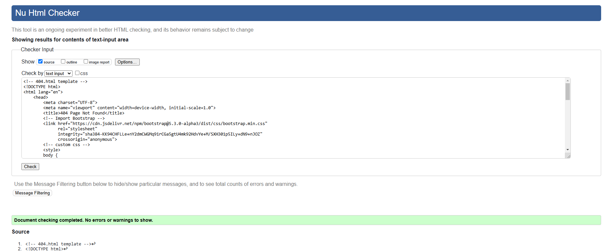
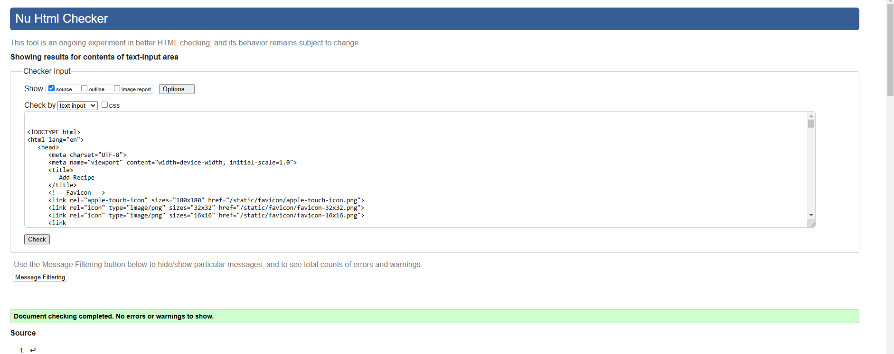
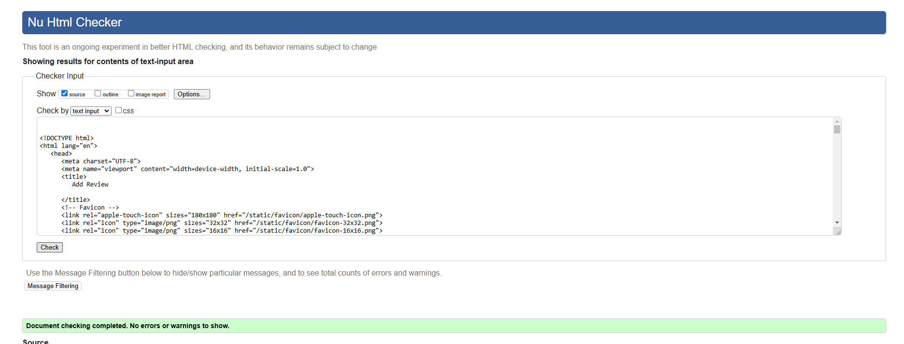
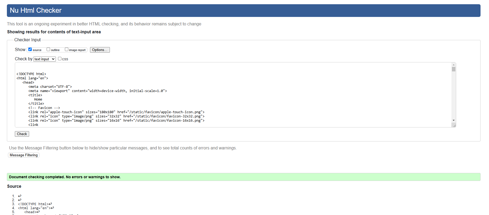
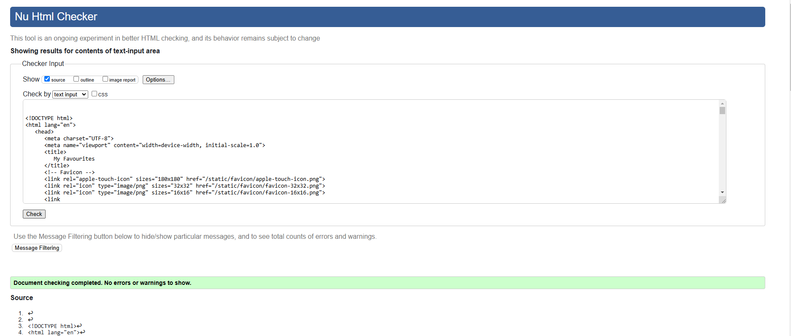
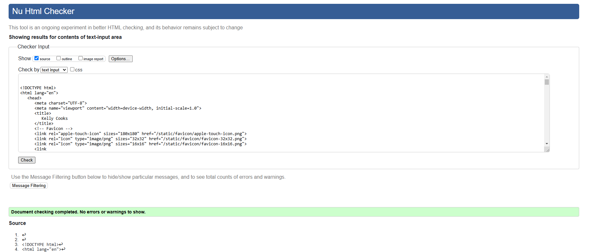

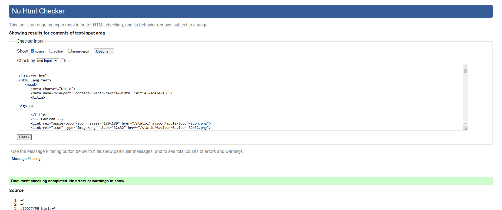
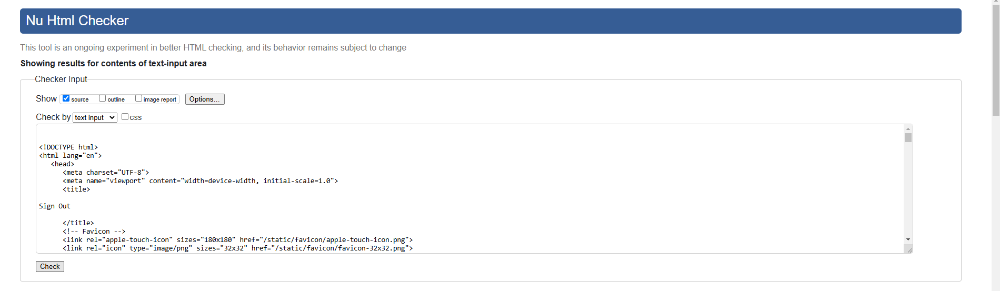
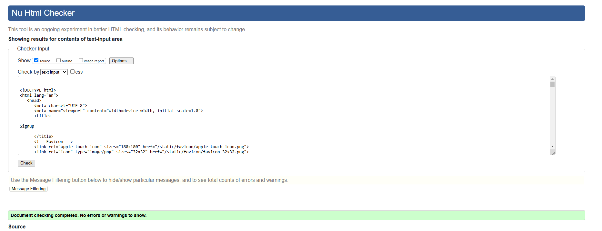

### CSS Validation
- Used **[W3C CSS Validator](https://jigsaw.w3.org/css-validator/)**.
- Ensured CSS follows best practices.
- Screenshots of validation results included:
  - 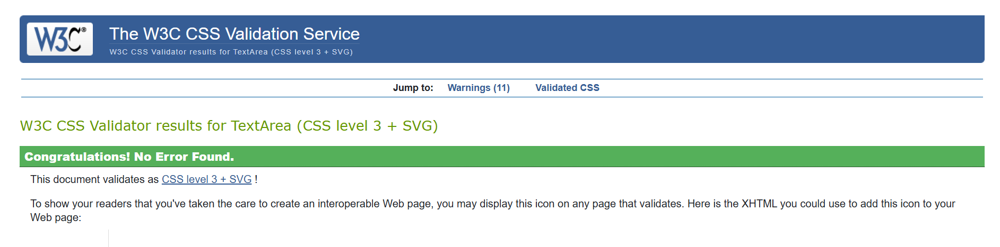

### Python Code Validation
- **CI Python Linter** used.
- Errors corrected where applicable.
- Screenshots of validation results included:
  - 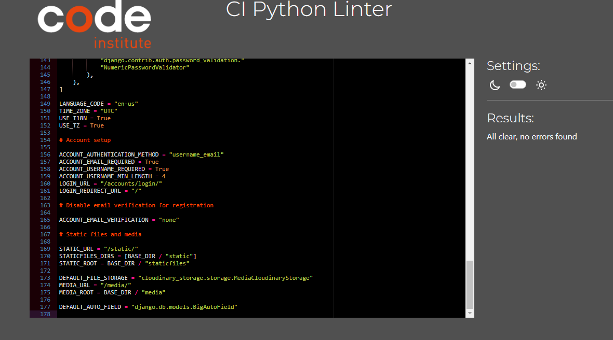
  - 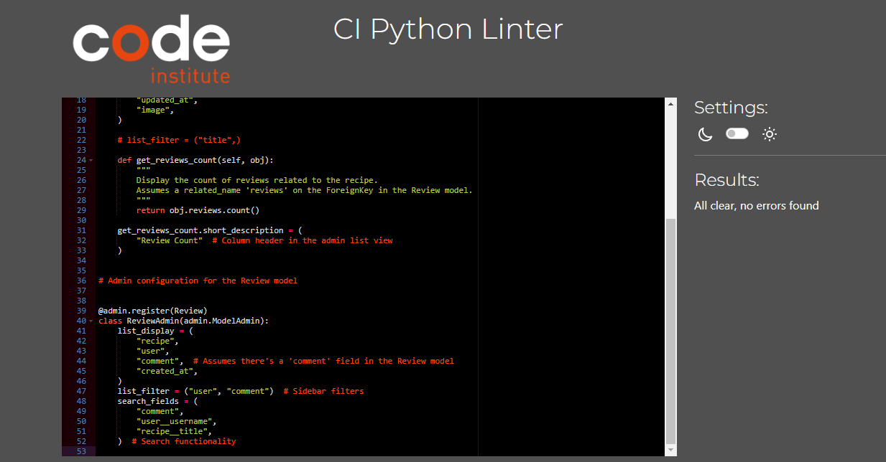
  - 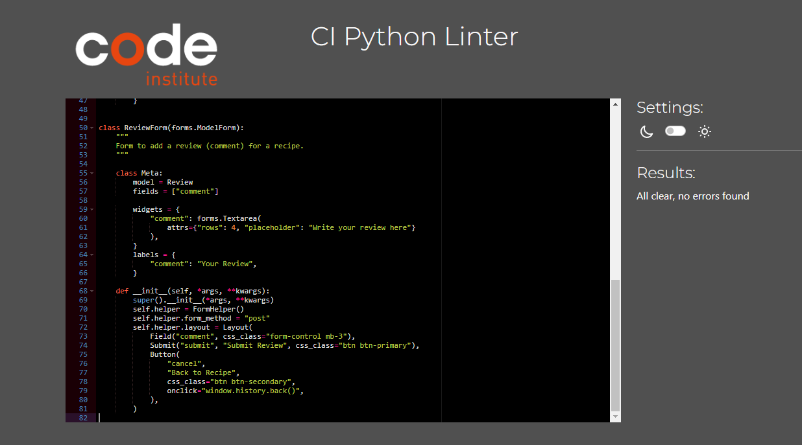
  - 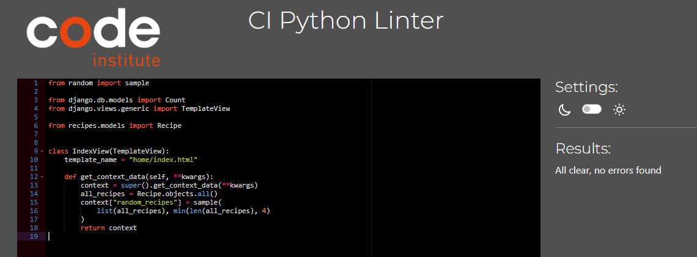
  - 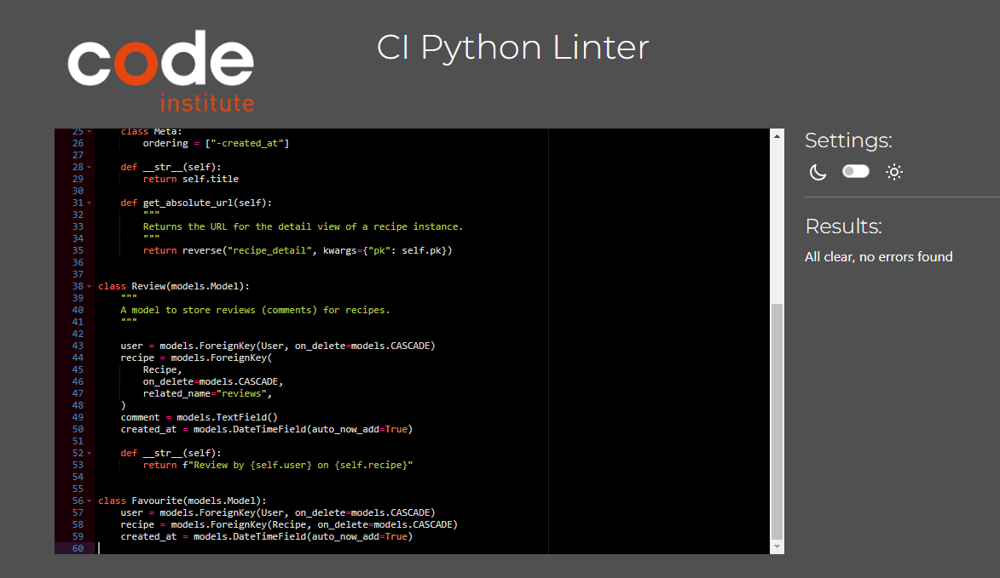
  - 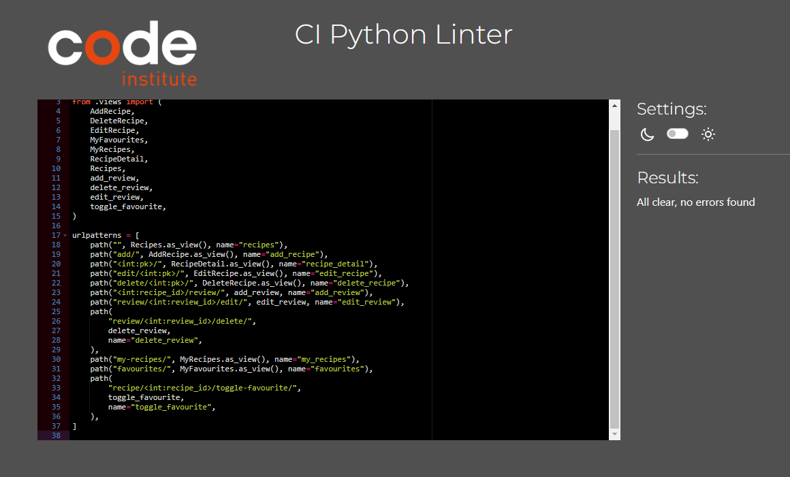
  - 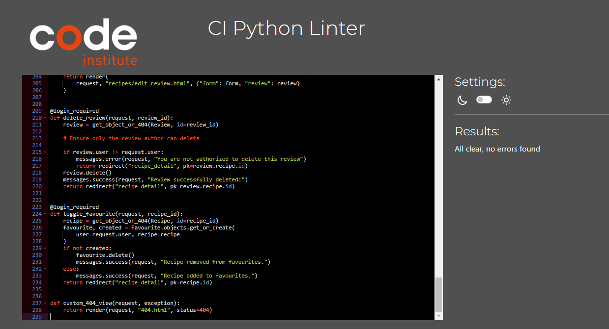

---

## Lighthouse Testing

**Google Lighthouse** was used to test the application’s **Performance, Accessibility, Best Practices, and SEO**.
- Results shown for the pages with most amount of images, therefore longest expected loading times. 
- Mobile Lighthouse Report: 
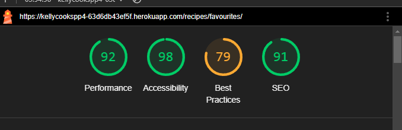
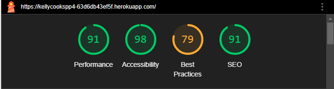
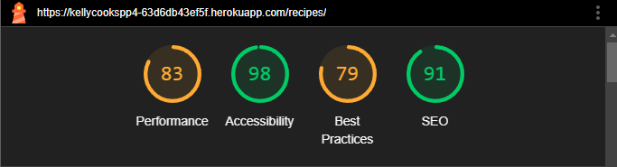

- Desktop Lighthouse Report: 
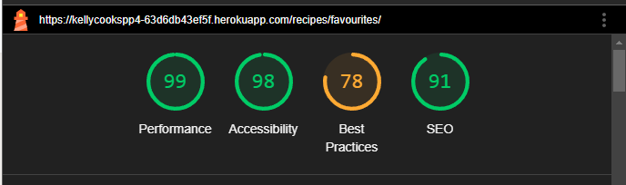
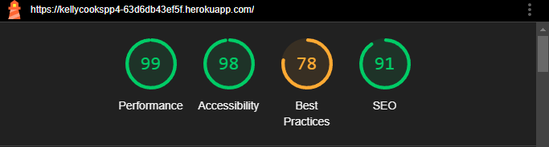
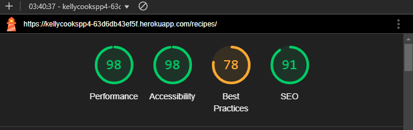

---

## Browser Compatibility

The site was tested across multiple browsers for consistency and responsiveness:

| **Browser** | **Result** |
|------------|-----------|
| Google Chrome | ✅ Pass |
| Mozilla Firefox | ✅ Pass |
| Microsoft Edge | ✅ Pass |

---

## Bugs & Fixes

| **Bug** | **Fix Implemented** |
|--------|-----------------|
| Image upload failure | Adjusted Cloudinary API settings |
| Navigation not working on mobile | Updated Bootstrap layout |
| Recipe images not displaying | Checked Cloudinary storage settings |
| Form validation errors not showing | Adjusted Django form validation logic |

---

This document will be updated as further testing is conducted and improvements are made.
