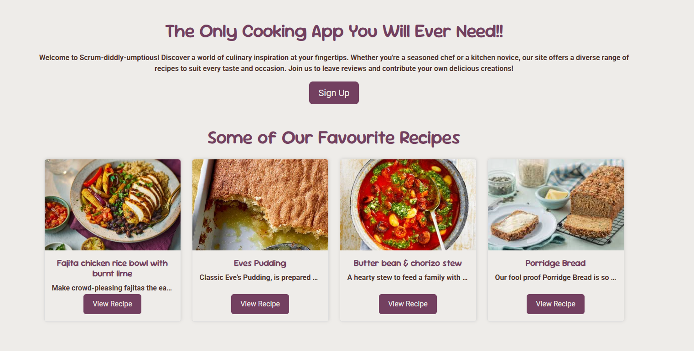
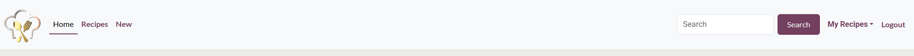

# Scrum-diddly-umptious

Scrum-diddly-umptious is a dynamic platform that lets users share, discover, and review recipes. Whether you're a passionate home chef or simply looking for new ideas in the kitchen, our site offers an engaging, community-driven experience where you can register, upload your favorite recipes, and review others’ culinary creations.

**Live Link:** https://kellycookspp4-63d6db43ef5f.herokuapp.com/


## Overview

Scrum-diddly-umptious provides an easy and engaging way to explore, share, and manage recipes. With a focus on user interaction, the site offers robust CRUD functionalities that allow registered users to create, read, update, and delete recipes. The site is designed with a mobile-first approach to ensure a seamless experience across all devices, utilizing responsive design frameworks like Bootstrap.

## Features

**Existing features:**

- **Homepage Overview:**
  - **Featured Recipes:** The homepage displays a selection of featured recipes along with brief descriptions and images.
  - **Navigation:**   The navigation menu is featured on all pages to provide a consistent means of navigating the site. The menu provides links to 'Home' page, 'Browse' page, 'My Recipe Book' page, 'Create Recipe' page, a login link when the user is unauthenticated and a logout link when the user is authenticated. It is fully responsive, collapsing into a navbar toggle button which presents the navigation menu as a dropdown menu. A navbar brand and image features on the left of the navbar, providing an additional link to the 'Home' page.
  - **Recipe Cards:** Each recipe is presented in a card format, offering a snapshot of the dish with a link to view full details.

  

  


- **User Account System:**
  - **Registration & Login:** Users can sign up for an account, log in, and manage their own recipes.
  - **Profile Management:** Registered users have personal profiles where they can view and edit their submitted recipes.

  
  

- **Recipe Management (CRUD):**
  - **Upload Recipes:** Users can create and upload new recipes with details such as ingredients, steps, images, and cooking times.
  - **Review and Edit:** After submission, users can review, edit, or delete their own recipes.
  - **Comments & Ratings:** Users can leave reviews, comments, and ratings on recipes to share their feedback and tips.

  
  

- **Search & Filter:**
  - **Recipe Search:** Easily search for recipes by keywords, ingredients, or categories.
  - **Filtering Options:** Filter recipes by cuisine, difficulty level, or cooking time.

- **Responsive Design:**
  - The site is built with a mobile-first approach ensuring it is fully responsive on all devices, from desktops to smartphones.

- **Admin Panel:**
  - **Site Administration:** Admins can manage user accounts, moderate recipes and comments, and ensure the overall integrity of the platform using a built-in admin interface.

**Future Features:**

- **Recipe Collections:** Allow users to create personal recipe collections or meal plans.
- **Social Sharing:** Enable sharing of recipes directly to social media platforms.
- **Advanced Filtering:** Introduce more granular filtering and search options for a better user experience.

## Agile Process

For project management, we used Agile methodologies with a GitHub project board and detailed user stories. This helped us keep track of features, bugs, and enhancements.

### Project Issues


<!-- Replace with your own screenshot if available -->

Our process was guided by the MOSCOW framework:
- **Must have:** Core features like recipe submission, user registration, and full CRUD functionality.
- **Should have:** Features such as recipe search and filtering.
- **Could have:** Advanced features like recipe collections and social sharing.
- **Won't have:** Features planned for future updates.

## User Stories

User stories were instrumental in defining the scope and functionality of the project.

| **USER STORY**                   | **DETAILS**                                                              | **ACCEPTANCE CRITERIA**                                          |
| -------------------------------- | ------------------------------------------------------------------------ | ---------------------------------------------------------------- |
| **Submit a Recipe**              | As a user, I can submit a new recipe so that I can share my culinary creations. | (1) A form is provided for recipe submission. (2) The recipe appears in my profile after submission. |
| **Browse Recipes**               | As a user, I can browse all recipes to find new meal ideas.             | (1) Recipes are listed on the homepage with a preview.            |
| **Rate and Comment**             | As a user, I can rate and comment on recipes to share feedback.         | (1) Only logged-in users can leave reviews. (2) Comments show the user's name and timestamp. |
| **Edit or Delete Recipe**        | As a user, I can update or delete my own recipes.                        | (1) Users see edit/delete options only on their own recipes.       |

<!-- Add more user stories as necessary -->

## Site Testing

For detailed testing procedures and results, please refer to the [TESTING.md](TESTING.md) document.

## UX/UI Wireframing

- **Design and Aesthetic:**
  - The site employs a clean, modern design with a focus on readability and ease of use.
  - A custom color palette and typography enhance the user experience and brand identity.

- **Navigation and Interaction:**
  - The navigation bar is designed for ease of access, ensuring users can find recipes, submit their own, and navigate their profiles effortlessly.

### Wireframe


### UI Colour Palette


## Technologies Used

### Languages & Frameworks

- **Frontend:**
  - HTML5/CSS3
  - Bootstrap (for responsive design)
  - JavaScript (for interactivity)

- **Backend:**
  - Django Framework (Python) for server-side logic and database management

### Libraries & Tools

- Django vX.X.X
- [Additional libraries such as Django AllAuth, Django Crispy Forms, etc.]
- Cloudinary (for media storage)
- PostgreSQL (for the database)

### External Resources

- **Testing & Validation:**
  - HTML: [W3C Validator](https://validator.w3.org/nu/)
  - CSS: [W3C CSS Validator](https://jigsaw.w3.org/css-validator/)
  - JavaScript: [JSHint](https://jshint.com/)
  - Accessibility: [WAVE](https://wave.webaim.org/)

## Django Project Setup

1. **Install Django and Required Libraries:**

   ```bash
   pip3 install django gunicorn
   pip3 install dj-database-url psycopg2
   pip3 install cloudinary
